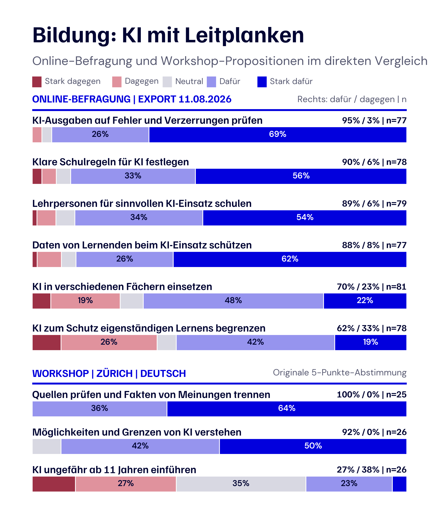
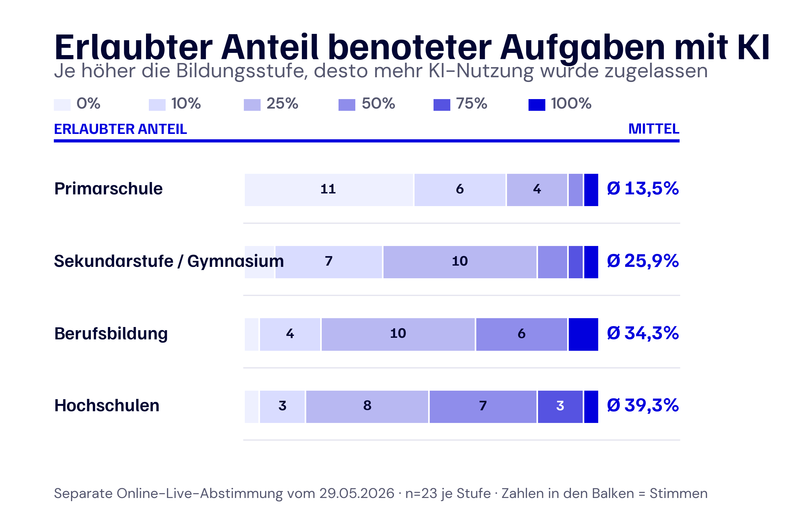
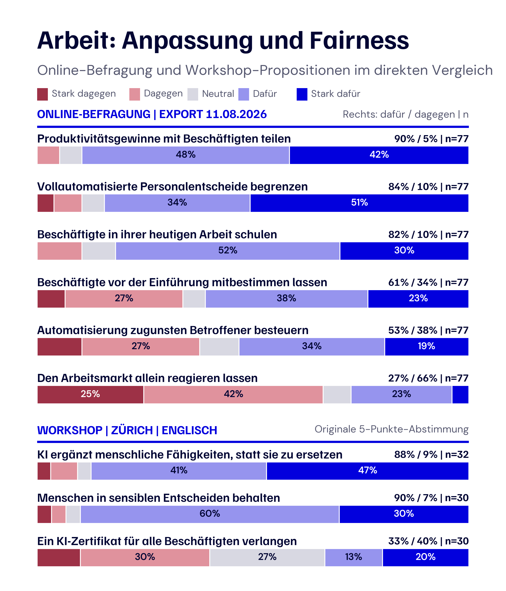
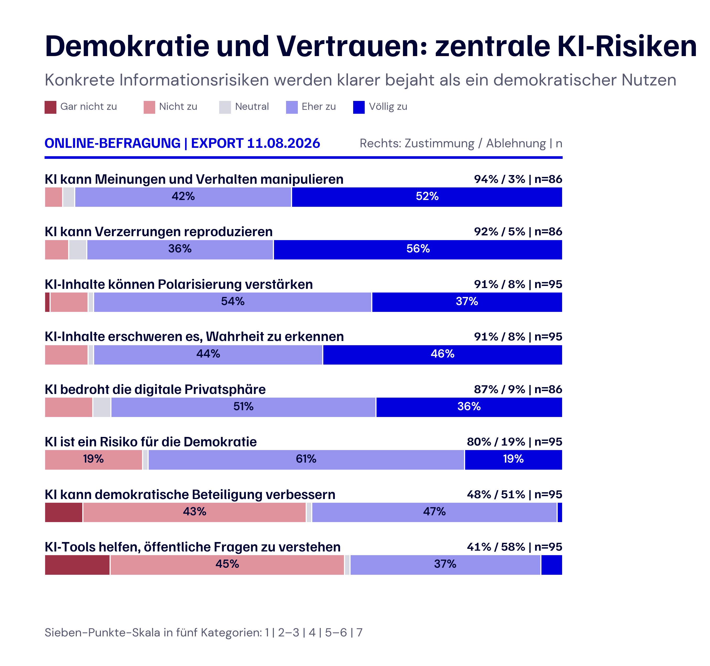
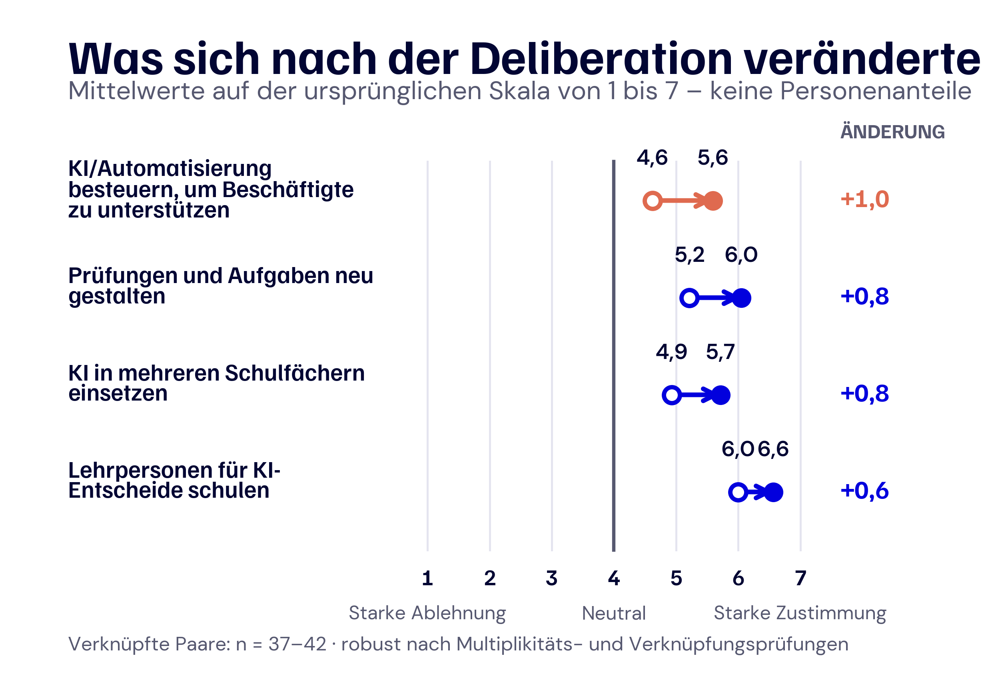

# 4. Öffentliche Sichtweisen auf KI: Chancen, Bedingungen und rote Linien

## 4.1 Wie die Sichtweisen der Bevölkerung erhoben wurden

### 4.1.1 Das Ziel: gesellschaftliche Prioritäten in das Projekt einbringen

KI-Politik ist nicht nur eine technische Frage. Entscheidungen über KI in Bildung, Arbeit und öffentlichem Leben hängen auch davon ab, was Menschen schützen wollen, welche Anwendungen sie für sinnvoll halten und wo sie klare Grenzen erwarten. Deshalb fragte dieser Teil des Projekts Bürgerinnen und Bürger direkt nach ihren Erfahrungen, Sorgen und Prioritäten.

Es ging nicht um ein einfaches «dafür» oder «dagegen». Die Teilnehmenden wurden gefragt, was sie akzeptieren würden, unter welchen Bedingungen und welche Anwendungen eine rote Linie überschreiten. Die Begründungen sind wichtig, weil dieselbe Anwendung in einem Kontext hilfreich und in einem anderen unakzeptabel sein kann.

Dieser Ansatz stützt sich auf die deliberative Demokratieforschung. Sie versteht öffentliche Urteilsbildung als mehr als das Zählen von Präferenzen: Menschen brauchen auch Raum, um Informationen abzuwägen, andere Perspektiven zu hören und die Werte hinter ihren Entscheidungen zu erklären (Bächtiger, Dryzek, Mansbridge und Warren, 2018; Fishkin, Luskin und Jowell, 1998).

### 4.1.2 Drei verknüpfte Quellen für Bürgerstimmen

Die Sichtweisen der Bevölkerung wurden in drei Schritten erhoben:

1. **Online-Befragung:** ein breites erstes Bild von KI-Nutzung, Vertrauen, wahrgenommenen Risiken, politischen Präferenzen und Freitextargumenten.
2. **Workshops in Zürich und Lausanne:** Kleingruppengespräche, die nach den Gründen fragten und daraus Bedingungen, rote Linien und politische Vorschläge entwickelten.
3. **Nachbefragung:** wiederholte Fragen, die zeigen, ob sich ausgewählte Positionen nach der Diskussion veränderten.

Die drei Quellen beantworten unterschiedliche Fragen. Die Online-Befragung schafft Breite. Die Workshops liefern Tiefe und die Sprache der Bürgerinnen und Bürger. Die Nachbefragung zeigt Veränderungen. Sie werden als sich ergänzende Evidenz ausgewertet, ihre Stichproben aber nicht zusammengelegt.

### 4.1.3 Was die Workshops ergänzten

Jede Workshopgruppe diskutierte KI in Bildung und Arbeit. Die Teilnehmenden benannten sinnvolle Anwendungen, praktische Bedenken und unakzeptable Folgen. Sie hielten Ideen auf Post-its fest, diskutierten Vorschläge, stimmten über ausgewählte Aussagen ab und erarbeiteten ein kurzes politisches Massnahmenpaket mit:

* zwei oder drei Empfehlungen;
* einer Begründung für jede Empfehlung; und
* verbleibender Uneinigkeit oder Unsicherheit.

Damit waren die Workshops mehr als eine weitere Meinungsumfrage. Sie zeigten, wie Teilnehmende eine Position begründeten – zum Beispiel, indem sie KI-unterstütztes Lernen befürworteten und zugleich verlangten, dass Lernende weiterhin selbstständig recherchieren, schreiben und Informationen prüfen.

### 4.1.4 Ein ergänzender Test KI-unterstützter Deliberation

Das Projekt testete zusätzlich, ob KI Gruppen beim Strukturieren einer Diskussion unterstützen kann. Jeder Raum diskutierte ein Thema mit menschlicher Moderation und das andere mit KI-Unterstützung. In den französisch- und deutschsprachigen Räumen wurde Arbeit menschlich moderiert und Bildung KI-unterstützt; in den englischsprachigen Räumen war die Reihenfolge umgekehrt.

In den KI-unterstützten Sitzungen überführte das System gesprochene Argumente in kurze Aussagen und Vorschlagsentwürfe. Die Teilnehmenden konnten jeden Output annehmen, ablehnen oder überarbeiten. Das System entschied nicht, was die Gruppe empfehlen sollte. Dieser Methodenvergleich ist in diesem Kapitel zweitrangig; im Mittelpunkt steht, was Bürgerinnen und Bürger sagten, unterstützten, ablehnten und vorschlugen.

### 4.1.5 Wie die Evidenz ausgewertet wurde

Die Analyse hielt drei Formen von Evidenz getrennt: Antwortverteilungen der Befragung, qualitative Aussagen und Gruppenergebnisse sowie verknüpfte Vorher-Nachher-Antworten. Freitexte und Workshopmaterialien wurden nach Thema und Funktion codiert: **Chance**, **Bedingung** oder **rote Linie**. Bei Zitaten und raumspezifischen Abstimmungen blieben Workshop und Sprache sichtbar.

Wiederholte Befragungsitems wurden auf ihrer ursprünglichen Sieben-Punkte-Skala mit verknüpften Vergleichen, Bootstrap-Unsicherheitsintervallen, Wilcoxon-Tests und einer Benjamini-Hochberg-Korrektur über zwanzig Items ausgewertet. Das verkürzte Feldinstrument erlaubte keine formale Berechnung des ursprünglich geplanten Deliberative Reason Index. Deshalb berichtet dieses Kapitel beobachtbare Veränderungen statt eines einzelnen Scores für deliberative Qualität.

### 4.1.6 Teilnehmende und Schutzmassnahmen

Die Rekrutierung erfolgte über zivilgesellschaftliche Organisationen, das TA-SWISS-Netzwerk und digitale Kanäle. Die Stichprobe zeigte ein überdurchschnittliches zivilgesellschaftliches Engagement, ein hohes Bildungsniveau und viel KI-Erfahrung. Sie beschreibt deshalb die Teilnehmenden und ist keine repräsentative Schätzung für die Schweizer Bevölkerung. Die Online-Teilnahme war unbezahlt; Workshopteilnehmende erhielten einen Gutschein im Wert von 40 CHF.

Die Teilnahme beruhte auf informierter Einwilligung. Kontakt- und Zahlungsdaten wurden getrennt von Forschungsdaten gespeichert, Antworten codiert oder pseudonymisiert und identifizierende Angaben in Freitexten oder Transkripten bei Bedarf entfernt. Ein Rückzug war ohne Nachteile möglich. In den KI-unterstützten Sitzungen blieben alle Zusammenfassungen und Vorschläge vorläufig und mussten von den Teilnehmenden bestätigt werden.

## 4.2 Was Bürgerinnen und Bürger über KI denken

Die Ergebnisse folgen einer einfachen Reihenfolge: die Grundhaltung zu KI, Sichtweisen auf Bildung, Arbeit und Demokratie, Veränderungen nach der Diskussion sowie Unterschiede zwischen den Workshopgruppen.

### 4.2.1 Drei Datenquellen, drei unterschiedliche Beiträge

Jede Quelle liefert eine andere Form von Evidenz.

| Datenquelle | Analytische Grundlage | Was sie zeigt |
| --- | --- | --- |
| Online-Befragung | Export vom 11. August 2026: 135 eingegangene Datensätze; 103 Personen nach Screening einbezogen; 485 auswertbare Freitextantworten; zusätzlich eine separate Live-Abstimmung vom 29. Mai mit 23 Personen | Breite: Ausgangseinstellungen, politische Präferenzen und die Sprache der Teilnehmenden |
| Workshops | Vier Räume; 76 Workshop-Fragebögen; 140 Post-it-Zeilen; 136 MURMI-Propositionen | Tiefe: Begründungen, Bedingungen, rote Linien, offene Entscheidungen und raumspezifische Abstimmungen |
| Nachbefragung | 76 Fragebögen; 49 eindeutig mit der Online-Baseline verknüpfte Personen; je Item 36 bis 44 Antwortpaare | Veränderung: wiederholte politische Positionen und Bewertungen nach den Workshops |

Ein Post-it hält eine Gruppenidee fest; eine Workshopproposition gehört zu dem Raum, der darüber abstimmte. Vorher-Nachher-Ergebnisse verwenden nur eindeutig verknüpfte Personen. Deshalb behalten die Abbildungen ihre eigenen Nenner und Skalen. Alle folgenden Online-Ergebnisse nutzen den Export vom 11. August, der die gescreente Stichprobe gegenüber der vorherigen Zwischenanalyse von 81 auf 103 Personen erhöhte.

### 4.2.2 Zentraler Befund: Offenheit mit Bedingungen

Die Bürgerinnen und Bürger waren weder pauschal für noch pauschal gegen KI. Sie begrüssten Anwendungen, die Lernen unterstützen, repetitive Arbeit verringern oder menschliche Fähigkeiten erweitern. Vorsicht entstand, wenn Unterstützung in Ersetzung überging, Kompetenzen verloren zu gehen drohten, Entscheidungen nicht anfechtbar waren oder Vorteile unfair verteilt wurden.

Die Nutzung war hoch, das Vertrauen begrenzt. 89 von 103 Personen nutzten KI mindestens wöchentlich, davon 68 täglich oder fast täglich. Doch nur 15 Prozent äusserten hohes Vertrauen in KI-generierte Texte; 57 von 100 überprüften KI-Antworten immer oder häufig. 92 Prozent stimmten zu, dass KI Verzerrungen reproduzieren kann, 90 Prozent warnten vor dem Verlust kritischen und eigenständigen Denkens und 91 Prozent sahen Vorteile, wenn Menschen den kompetenten Umgang mit KI lernen.

Deshalb unterscheidet die qualitative Analyse **Chancen**, **Bedingungen** und **rote Linien**, statt Aussagen nur als positiv oder negativ einzuordnen. Eine Person schrieb online: „Quellen zu prüfen, Ergebnisse infrage zu stellen und sich zu fragen, was wir letztlich produzieren wollen, sind entscheidend, um Chancen und Risiken der KI-Nutzung zu unterscheiden.“ Eine andere sagte: „Nicht die IT-Abteilungen sollten diese Entscheidungen treffen. Auch die anderen Beschäftigten sollten mitreden, denn sie sind von den Folgen betroffen.“ Beide Aussagen wurden ins Deutsche übersetzt und leicht gekürzt.

| Thema | Auszug aus dem Workshop | Workshop |
| --- | --- | --- |
| Bildung | „KI sollte in irgendeiner Form genutzt werden, aber Schulen sollten grundlegende kritische Fähigkeiten vom Werkzeuggebrauch unterscheiden. KI sollte Schülerinnen und Schüler zum Denken anregen; schwierigere Aufgaben können sie dann nutzen, um das Niveau der Übung zu erhöhen.“ | Zürich, Englisch |
| Bildung | „Schülerinnen und Schüler müssen weiterhin wissen, wie man recherchiert, die richtigen Fragen stellt und prüft, was erfunden ist. KI als Ausgangspunkt nutzen, Informationen danach selbst prüfen; vielleicht zuerst selbst schreiben und KI erst zum Überarbeiten einsetzen.“ | Zürich, Englisch |
| Bildung | „Die Freiheit sollte mit dem Alter zunehmen: streng in der Primarschule, vollständig offen auf Doktoratsstufe. KI soll zum Korrigieren und Verbessern dienen, nicht zum Ersetzen.“ | Lausanne, Englisch |
| Arbeit | „Woher wissen wir, welche KI die beste ist? Die Verantwortung sollte zwischen Staat, Arbeitgebern und Bildung geteilt werden.“ | Lausanne, Französisch |
| Arbeit | „Unternehmen dürfen den Einsatz von KI verlangen; dann sollten sie aber staatlich unterstützte Schulungen für den Umgang damit anbieten – als Arbeitnehmerschutz.“ | Zürich, Deutsch |
| Arbeit | „Wie werden Produktivitätsgewinne verteilt? In einem Beispiel wechselten Mitarbeitende aus dem Kundendienst in eine Fernberatung für Innenraumgestaltung: Beim Wandel können neue Rollen entstehen.“ | Zürich, Deutsch |

Die französischen und englischen Aussagen wurden ins Deutsche übersetzt; alle Auszüge wurden für Grammatik und Länge leicht bearbeitet. Daraus ergibt sich ein einfacher **Erweiterungstest**: KI ist sinnvoll, wenn sie menschliche Fähigkeiten vergrössert, ohne die zugrunde liegende Kompetenz oder menschliche Verantwortung verschwinden zu lassen.

### 4.2.3 Bildung: KI mit Leitplanken

Im Bildungsbereich besteht der stärkste Konsens nicht über möglichst viel Werkzeugnutzung, sondern über die Fähigkeit, KI kritisch zu beurteilen. Im aktualisierten Export unterstützten 95 Prozent, Schülerinnen und Schüler im Erkennen von Fehlern und Verzerrungen zu schulen; nur 3 Prozent widersprachen (n = 77). Auch Lehrpersonenfortbildung, klare Regeln und der Schutz von Daten der Lernenden erhielten bei jeweils 77 bis 79 gültigen Antworten rund 88 bis 90 Prozent Unterstützung.

  

<em>Abb. 19: Bildung – KI mit Leitplanken. Oben stehen ausgewählte Items aus dem Online-Export vom 11. August 2026 auf einer zu fünf Kategorien zusammengefassten Sieben-Punkte-Skala. Unten stehen Propositionen aus dem deutschsprachigen Zürcher Workshop auf ihrer ursprünglichen Fünf-Punkte-Skala. Die Quellen werden nicht gepoolt; rechts sind Unterstützung, Ablehnung und der jeweilige Nenner angegeben.</em>

Die konkrete Umsetzung war umstrittener. 70 Prozent unterstützten KI über verschiedene Schulfächer hinweg, während 62 Prozent zugleich Grenzen zum Schutz traditionellen Lernens wollten. 72 Prozent befürworteten eine Neugestaltung von Prüfungen und Aufgaben; knapp ein Viertel war dagegen. Im Zentrum stand die Frage, wann direkte KI-Nutzung beginnen soll und wie Schulen weiterhin erkennen können, was Lernende selbst verstanden haben.

Eine separate Live-Abstimmung vom 29. Mai fragte 23 Personen, welchen Anteil KI-unterstützter benoteter Arbeit sie je Bildungsstufe zulassen würden.

  

<em>Abb. 20: Erlaubter Anteil benoteter Aufgaben mit KI. Die Farben zeigen, welchen Anteil KI-unterstützter benoteter Aufgaben die 23 Abstimmenden je Bildungsstufe zulassen würden; Zahlen in den Balken sind Stimmen. Rechts steht der Mittelwert der gewählten Anteile.</em>

Der erlaubte Anteil stieg mit der Bildungsstufe. In der Primarschule liessen 17 von 23 Personen höchstens 10 Prozent KI-unterstützte benotete Arbeit zu; an Hochschulen erlaubten 11 von 23 mindestens 50 Prozent. Der Mittelwert stieg von 13,5 Prozent in der Primarschule auf 39,3 Prozent an Hochschulen. Das spricht für schrittweise wachsenden Freiraum statt für ein pauschales Verbot.

Die Workshopabstimmungen bestätigten diese Unterscheidung. Alle 25 erfassten Personen im deutschsprachigen Zürcher Raum unterstützten, dass Lernende Fakten von Meinungen unterscheiden und Quellen prüfen können sollen; nur 7 von 26 befürworteten eine Einführung von KI ungefähr ab elf Jahren. Post-its schlugen schrittweise Hinweise statt fertiger Antworten, eigenes Schreiben vor der KI-Überarbeitung, Offenlegung der KI-Nutzung, beaufsichtigte Leistungskontrollen und geschützte Räume für eigenständiges Arbeiten vor. Konsens bestand über kritische Nutzung; der richtige Startzeitpunkt blieb offen.

### 4.2.4 Arbeit: Anpassung und Fairness

Bei der Arbeit war die Unterstützung für Fairness und menschliche Verantwortung am stärksten. 90 Prozent wollten Arbeitnehmende an Produktivitätsgewinnen beteiligen. 84 Prozent befürworteten Grenzen für vollständig automatisierte Einstellungs-, Entlassungs- und Leistungsentscheidungen, 83 Prozent eine Überwachung möglicher Diskriminierung und 82 Prozent Weiterbildung für die gegenwärtige Tätigkeit (jeweils n = 77).

  

<em>Abb. 21: Arbeit – Anpassung und Fairness. Oben stehen Präferenzen aus dem Online-Export vom 11. August 2026, unten ausgewählte Propositionen aus dem englischsprachigen Zürcher Workshop. Die beiden Quellen bleiben getrennt.</em>

Bei den Instrumenten gingen die Meinungen auseinander. Mitsprache vor der Einführung von KI am Arbeitsplatz erhielt 61 Prozent Unterstützung und 34 Prozent Ablehnung; eine Besteuerung von KI oder Automatisierung zugunsten betroffener Arbeitnehmender 53 Prozent Unterstützung und 38 Prozent Ablehnung. Doch nur 27 Prozent wollten den Arbeitsmarkt weitgehend allein reagieren lassen; 66 Prozent lehnten dies ab.

Die Teilnehmenden forderten berufsspezifische Weiterbildung, anfechtbare automatisierte Entscheidungen und eine faire Beteiligung an Produktivitätsgewinnen. Im englischsprachigen Zürcher Workshop unterstützten 88 Prozent die Ergänzung statt Ersetzung menschlicher Fähigkeiten, und 90 Prozent wollten Menschen in sensiblen Entscheidungen behalten. Ein einheitliches KI-Zertifikat für alle Arbeitnehmenden erhielt nur 33 Prozent Unterstützung. Die Richtung war klarer als das Instrument: Institutionen sollen den Wandel gestalten und verantwortlich bleiben.

### 4.2.5 Demokratie und Vertrauen: konkrete Risiken

Die aktualisierte Online-Befragung unterscheidet zwischen konkreten Informationsrisiken und allgemeinen Erwartungen an den demokratischen Nutzen von KI. Mindestens eher zustimmend antworteten 94 Prozent auf die Aussage, KI könne Meinungen und Verhalten manipulieren, 92 Prozent auf die Reproduktion von Verzerrungen und je 91 Prozent auf stärkere Polarisierung sowie die Schwierigkeit, Wahrheit zu erkennen. Auch die Bedrohung der digitalen Privatsphäre erhielt 87 Prozent Zustimmung. Die gültigen Nenner lagen je nach Item bei 86 oder 95.

  

<em>Abb. 22: Demokratie und Vertrauen. Die Abbildung nutzt den Online-Export vom 11. August 2026 und zeigt die vollständige Verteilung auf der zu fünf Kategorien zusammengefassten Sieben-Punkte-Skala. Rechts stehen Zustimmung, Ablehnung und der jeweilige Nenner.</em>

Das abstraktere Urteil fiel weniger eindeutig aus. 80 Prozent stimmten mindestens eher zu, dass KI ein Risiko für die Demokratie darstellt; bei einem möglichen Beitrag zu besserer demokratischer Beteiligung standen sich 48 Prozent Zustimmung und 51 Prozent Ablehnung gegenüber. Nur 41 Prozent sahen KI-Tools als Hilfe beim Verständnis öffentlicher Fragen, 58 Prozent widersprachen. Gleichzeitig unterstützten 78 Prozent von 93 Antwortenden öffentliche Abstimmungen oder Bürgerkonsultationen zur KI-Regulierung. Die politische Folgerung lautet deshalb nicht, demokratische Funktionen an KI zu übertragen. Vorrangig sind Schutz vor Manipulation, überprüfbare Informationen und Beteiligungsverfahren, in denen Menschen die Entscheidung behalten.

### 4.2.6 Was sich nach der Diskussion veränderte

Vier der zwanzig wiederholten Positionen veränderten sich in allen statistischen Prüfungen robust. Die Abbildung zeigt die mittlere Unterstützung auf der ursprünglichen Skala von 1 bis 7. Die Pfeile messen Skalenpunkte, nicht den Anteil der Personen, die ihre Antwort änderten.

  

<em>Abb. 23: Vier robuste Vorher-Nachher-Veränderungen. Offene Kreise zeigen den Online-Mittelwert, gefüllte Kreise den Mittelwert nach dem Workshop. Rechts steht die Veränderung in Punkten auf der Sieben-Punkte-Skala.</em>

Die grösste Veränderung betraf die Unterstützung für eine Besteuerung von KI- oder Automatisierungsgewinnen zugunsten betroffener Arbeitnehmender: Der Mittelwert stieg von 4,6 auf 5,6. Die Zustimmung zur Neugestaltung von Prüfungen und Aufgaben stieg von 5,2 auf 6,0, zur Nutzung von KI über Schulfächer hinweg von 4,9 auf 5,7 und zur Lehrpersonenfortbildung von 6,0 auf 6,6.

Dies war keine allgemeine Bewegung hin zu «mehr KI». Die Positionen verschoben sich in Richtung einer **gesteuerten Integration**: mehr Offenheit für schulische Nutzung zusammen mit besserem Prüfungsdesign, höherer Lehrpersonenkompetenz und einer faireren Verteilung von Automatisierungsgewinnen.

### 4.2.7 Was sich zwischen den Workshopgruppen unterschied

Die vier Räume unterschieden sich nach Ort, Sprache, Grösse, Themenreihenfolge und Teilnehmendenprofil. Die Tabellen behalten dieselbe Raumreihenfolge bei, damit diese Unterschiede sichtbar werden.

**Tabelle 4.1: Workshopergebnisse**

| Workshop | Sitzungsreihenfolge | Unterstützung der Workshoppropositionen | Massnahmenpaket akzeptiert |
| --- | --- | ---: | ---: |
| Lausanne, Französisch | Arbeit → KI-Bildung | 79 % | 69 % (9/13) |
| Lausanne, Englisch | Bildung → KI-Arbeit | 68 % | 83 % (5/6) |
| Zürich, Deutsch | Arbeit → KI-Bildung | 74 % | 82 % (14/17) |
| Zürich, Englisch | Bildung → KI-Arbeit | 68 % | 91 % (21/23) |

**Tabelle 4.2: Verknüpftes Ausgangsprofil**

| Workshop | Verknüpftes n | Unter 35 Jahre | Hochschulabschluss | Mindestens wöchentliche KI-Nutzung |
| --- | ---: | ---: | ---: | ---: |
| Lausanne, Französisch | 9 | 22 % | 56 % | 67 % |
| Lausanne, Englisch | 5 | 40 % | 100 % | 80 % |
| Zürich, Deutsch | 15 | 67 % | 67 % | 93 % |
| Zürich, Englisch | 18 | 89 % | 89 % | 89 % |

Die verknüpfte französischsprachige Lausanner Gruppe war älter und weniger stark akademisch geprägt als die deutschsprachige Zürcher Gruppe. In den beiden englischsprachigen Räumen lag die Unterstützung über die jeweiligen Propositionen hinweg bei 68 Prozent; das kleine verknüpfte Lausanner Profil umfasste jedoch nur fünf Personen. Da jeder Raum über andere Aussagen abstimmte und sich mehrere Faktoren gleichzeitig unterschieden, belegen diese Werte keine Sprach- oder Standorteffekte. Sie zeigen, warum der Gruppenkontext bei der Interpretation von Bürgerstimmen sichtbar bleiben muss. Die separate Bewertung des KI-unterstützten Formats lag je nach Raum zwischen 4,3 und 5,6 auf einer Sieben-Punkte-Skala und wird als ergänzendes Methodenergebnis behandelt.

## 4.3 Was Bürgerinnen und Bürger von der Politik erwarten

Aus den Befunden folgen sechs direkte politische Prioritäten:

1. **Prüfen lehren, nicht nur Werkzeuge bedienen.** Schülerinnen, Schüler und Arbeitnehmende sollen Quellen kontrollieren, Ergebnisse hinterfragen und erkennen können, wann KI nicht verlässlich ist.
2. **Menschen schulen, bevor KI vorausgesetzt wird.** Lehrpersonen und Arbeitnehmende brauchen Vorbereitung auf die Entscheidungen, die sie tatsächlich treffen müssen; diese Weiterbildung muss mit den Werkzeugen Schritt halten.
3. **Regeln vor der Einführung festlegen.** Schulen und Arbeitgeber sollen Zweck, Datennutzung, Qualitätskontrolle und Verantwortung benennen, bevor KI eingesetzt wird.
4. **Folgenreiche Entscheidungen menschlich verantworten.** Einstellung, Entlassung, Leistungsbewertung und Prüfungsentscheidungen brauchen nachvollziehbare menschliche Aufsicht und einen klaren Beschwerdeweg.
5. **Informationsintegrität demokratisch schützen.** Regeln gegen Manipulation und irreführende Inhalte brauchen unabhängige Prüfung, nachvollziehbare Quellen und öffentliche Beteiligung; KI soll demokratische Urteile informieren, nicht ersetzen.
6. **Zugang und Gewinne fair verteilen.** Schulen mit knappen Ressourcen, kleine Unternehmen und vom Wandel betroffene Arbeitnehmende brauchen praktische Unterstützung; die Vorteile dürfen nicht nur bereits privilegierten Gruppen zufliessen.

Einige Umsetzungsfragen sind noch nicht reif für eine einheitliche Regel. Vor einer breiten Einführung sollte erprobt werden,

- ab welchem Alter direkte KI-Nutzung im Unterricht sinnvoll ist;
- ob ein einheitliches KI-Zertifikat sehr unterschiedlichen Berufen gerecht wird;
- wie Arbeitnehmende an Einführungsentscheidungen beteiligt werden sollen; und
- welche Formen der Gewinnbeteiligung oder Besteuerung in der Praxis funktionieren.

> **Kernaussage:** KI soll menschliche Fähigkeiten stärken – nicht menschliche Verantwortung ersetzen.

**Daten und Reproduzierbarkeit.** Der Analysestand vom 21. August 2026 umfasst Skripte, aggregierte Tabellen, Quell-Hashes, übersetzte Auszüge und Abbildungen. Eingeschränkt zugängliche Verknüpfungsdaten und individuelle Abstimmungsdaten werden nicht veröffentlicht.
