# 4. Bürgerstimmen zu KI

Aufbauend auf den früheren Phasen von Swiss AI Futures wandten wir uns Menschen zu, die KI bereits im Studium, bei der Arbeit oder im Alltag begegneten. Wir wollten verstehen, wie sie diese Entwicklung erlebten, wo sie einen Nutzen sahen, was ihnen Sorgen bereitete und was sie von der Politik erwarteten.

Den Anfang machte ein Online-Modul zu Erfahrungen, Einstellungen und politischen Präferenzen. Anschliessend luden wir eine Teilgruppe ein, das Gespräch in vier Workshops fortzusetzen. Zwei fanden in Zürich in der Deutschschweiz statt, einer auf Deutsch und einer auf Englisch; zwei weitere in Lausanne in der Romandie, einer auf Französisch und einer auf Englisch. Zu Beginn jedes Workshops zeigten wir die zusammengefassten Online-Ergebnisse. So sahen alle, wo sich die Sichtweisen deckten, wo sie auseinanderlagen und welche Fragen offenblieben. Diese gemeinsame Ausgangslage rückte die wichtigsten Diskussionspunkte ins Zentrum, bevor die Gruppen konkretere Empfehlungen, Bedingungen und ungelöste Fragen entwickelten.

Als Moderierende baten wir jede Gruppe, mit Post-its, Propositionen, Abstimmungen und gemeinsam geprüften Zusammenfassungen eine strukturierte Spur ihrer Arbeit zu hinterlassen. Diese Ergebnisse lassen sich klar darstellen. Ein grosser Teil des Werts entstand jedoch im Gespräch selbst, als Menschen ihre Erfahrungen erklärten, ungewohnte Anliegen anhörten, Ideen überdachten und Meinungsverschiedenheiten gemeinsam bearbeiteten.

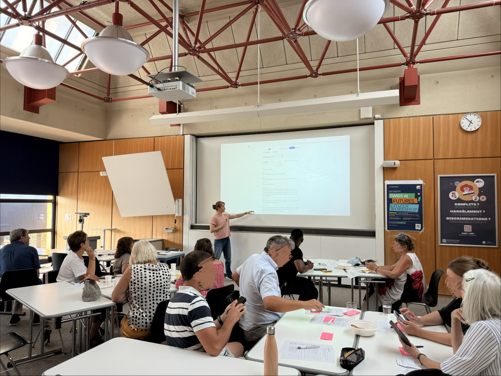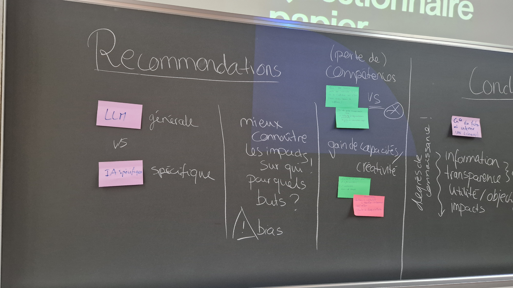

<em>Bürgerworkshops in der Praxis: Die Teilnehmenden prüfen Ideen gemeinsam und halten ihre Empfehlungen auf Post-its fest. Fotos aus den Swiss-AI-Futures-Workshops, August 2026.</em>

In diesen Gesprächen war die Akzeptanz von KI fast immer an Bedingungen geknüpft. Die Teilnehmenden sahen einen echten Nutzen für Bildung und Arbeit und wollten, dass sich dieser Nutzen zusammen mit einem wirksamen Schutz menschlicher Fähigkeiten, der Privatsphäre, der Verantwortlichkeit, der Informationsintegrität und des fairen Zugangs entwickelt.

## 4.1 Von der Online-Befragung zur Workshopdiskussion

Knapp 200 Personen begannen das Online-Modul, und bis zum 11. August enthielt der Datenexport 135 eindeutig zuordenbare Einträge. Für die Auswertung entfernten wir Fälle, bei denen Einwilligung oder Teilnahmeberechtigung fehlten, die zu wenig Antworten enthielten, doppelt vorkamen oder aus Tests stammten. Nach dieser Bereinigung bildeten 103 vollständige oder ausreichend auswertbare Fälle den Datensatz für dieses Kapitel; bei Fragen, die einzelne Personen ausliessen, liegt die Zahl tiefer. Die Gruppe umfasste verschiedene Altersgruppen, Sprachregionen und Kantone, enthielt aber zugleich viele Personen mit Hochschulabschluss und häufiger KI-Nutzung.

  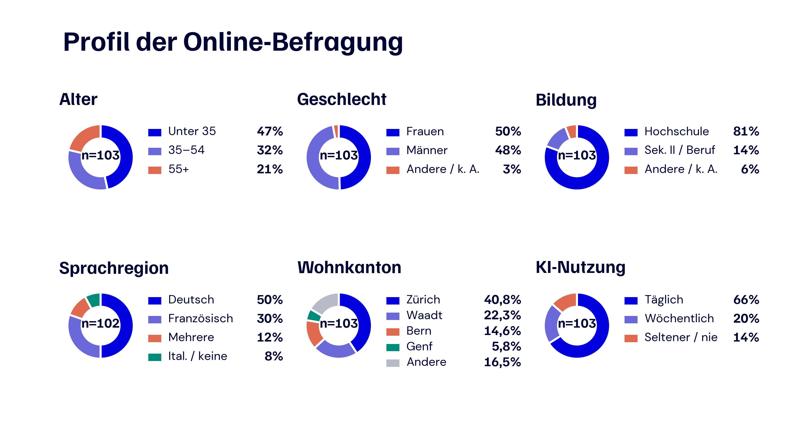

<em>Abb. 19: Profil der Online-Teilnehmenden. Die Diagramme verwenden Prozentanteile, damit sich Alter, Geschlecht, Bildung, Sprachregion, Wohnkanton und Häufigkeit der KI-Nutzung direkt vergleichen lassen. Für die Sprachregion gilt n = 102, für alle anderen Darstellungen n = 103.</em>

Unter den 103 bereinigten Profilen hatten 81 Prozent einen Hochschulabschluss, und 66 Prozent nutzten KI täglich oder fast täglich. 50 Prozent ordneten sich der Deutschschweiz zu und 30 Prozent der Romandie. Zürich, Waadt und Bern waren die häufigsten Wohnkantone; «Andere» fasst acht weitere Kantone sowie gemischte oder unklare Antworten zusammen.

Wir hielten die Teilnahme für alle teilnahmeberechtigten Erwachsenen offen und rekrutierten ohne demografische Quoten. Wer die Einladung sah und teilnehmen konnte, hing in der Praxis von unseren Projekt- und zivilgesellschaftlichen Netzwerken, dem TA-SWISS-Netzwerk, digitalen Kanälen, dem ETH Decision Lab/UAST-Pool sowie von Ort und Sprache der Workshops ab. Die Ergebnisse sind deshalb als strukturierter Beitrag einer engagierten Gruppe mit beträchtlicher KI-Erfahrung zu lesen; auf die gesamte Schweizer Bevölkerung lassen sie sich nicht hochrechnen.

Als eine Teilgruppe der Online-Teilnehmenden zu den Workshops kam, unterschieden sich die vier Räume bei Alter, Bildung und täglicher KI-Nutzung. Tabelle 4.1 verwendet die verfügbaren, geprüften Online-Profile für den jeweiligen Raum, weshalb die Nenner zwischen den Workshops variieren.

**Tabelle 4.1: Profile der Workshopgruppen**

| Workshop | Teilnehmende | Durchschnittsalter, geschätzt | Hochschulabschluss | Tägliche KI-Nutzung |
| --- | ---: | ---: | ---: | ---: |
| Zürich, Deutsch | 20 | 33 Jahre | 67% | 67% |
| Zürich, Englisch | 35 | 27 Jahre | 89% | 67% |
| Lausanne, Französisch | 14 | 50 Jahre | 56% | 44% |
| Lausanne, Englisch | 7 | 42 Jahre | 100% | 80% |
| **Gesamt** | **76** | **35 Jahre** | **77%** | **64%** |

Da die Befragung Altersgruppen statt exakter Altersangaben erfasste, sind die Mittelwerte in der Tabelle Schätzungen. Wir verwendeten jeweils die Mitte der Altersgruppe und setzten für die offene Gruppe ab 65 Jahren einen Wert von 70 Jahren an. Die Gesamtwerte zum Profil verbinden die 47 geprüften Online-Profile, die wir den Workshopräumen zuordnen konnten; die Zahl der Teilnehmenden umfasst alle 76 anwesenden Personen.

An den Tischen wurden diese Rekrutierungsmuster im Charakter der einzelnen Räume sichtbar. Am englischsprachigen Zürcher Workshop nahmen zum Beispiel viele Personen mit ETH-Bezug teil, weshalb die Gruppe jünger und akademisch geprägt war, während die französischsprachige Lausanner Gruppe älter war und KI seltener nutzte. Dieses Wissen hilft, die Gespräche zusammen mit Gruppengrösse und Themenreihenfolge einzuordnen, belegt jedoch keinen ursächlichen Einfluss von Ort oder Sprache auf die geäusserten Ansichten.

Vor diesem Hintergrund bearbeiteten alle vier Gruppen dieselben beiden grossen Themen, Bildung und Arbeit, setzten innerhalb dieser Themen aber unterschiedliche Schwerpunkte. Die folgenden Punkte zeigen, womit sich die Gespräche hauptsächlich befassten, ohne daraus eine Rangfolge der Workshops zu machen.

**Worüber die vier Workshopgruppen hauptsächlich sprachen**

- **Zürich, Deutsch:** In der Bildung ging es um Quellenprüfung, die Vorbereitung der Lehrpersonen, Schülerdaten, Grundkompetenzen vor der KI-Nutzung und das offene Einstiegsalter. Bei der Arbeit standen menschliche Kompetenz, eigenständiges Urteil, Privatsphäre, berufsspezifische Weiterbildung, ältere Beschäftigte und eine mögliche Pflicht zur KI-Nutzung im Mittelpunkt. Der Ton war pragmatisch und vom Ausloten konkreter Grenzen geprägt: Die Teilnehmenden waren offen für den Einsatz von KI und fragten wiederholt, was in menschlicher Verantwortung bleiben soll, wie Regeln im Alltag funktionieren und wer Beschäftigte ausbilden und schützen muss.
- **Zürich, Englisch:** Die Bildungsdiskussion behandelte den alters- und fachspezifischen Einsatz, KI-Kompetenz im Lehrplan, Offenlegung, Prüfungen, geeignete Schulwerkzeuge sowie die Rollen von Lehrpersonen und Eltern. Bei der Arbeit ging es um die Ergänzung menschlicher Fähigkeiten, Weiterbildung, Berufswechsel, menschliche Kontrolle sensibler Entscheide, Nutzungspflichten und Zertifizierung. Das Gespräch war lebhaft und technisch versiert und wechselte mühelos von allgemeinen Grundsätzen zu Lehrplänen, Werkzeugdesign, Zertifizierung und organisatorischer Umsetzung; zugleich waren bei Nutzungspflichten und universellen Lösungen deutliche Meinungsunterschiede sichtbar.
- **Lausanne, Französisch:** In der Bildung kehrte die Gruppe zu begleitetem Lernen, KI als Hilfsmittel, der Vorbereitung der Lehrpersonen, dem Zweck der Schule und einem möglichen Verlust von Fähigkeiten zurück. Bei der Arbeit standen kognitive Unabhängigkeit, Privatsphäre, souveräne Werkzeuge, geteilte Verantwortung, fairer Zugang und die Verteilung von Produktivitätsgewinnen im Vordergrund. Die Diskussion war nachdenklich und grundsatzorientiert und begann häufig bei kognitiver Souveränität, Kompetenzverlust, Privatsphäre und Ungleichheit, bevor es um die Aufgaben von Schulen, Arbeitgebern und öffentlichen Institutionen ging.
- **Lausanne, Englisch:** Die Bildungsdiskussion verband Lehrplan, kritische Prüfung, Lernziele, mündliche Prüfungen, Offenlegung, Umweltkosten, Alter und Zweck. Bei der Arbeit verband die Gruppe staatliche Regulierungsfähigkeit, Weiterbildung, Privatsphäre, Grenzen der Beschäftigtenüberwachung, Arbeitsbelastung, Haftung, Zugang und die Aufgabenteilung zwischen Unternehmen und Staat. In diesem kleineren Raum öffneten praktische Fragen eine breite Debatte über kollektive Kontrolle, mit besonderer Aufmerksamkeit für staatliche Handlungsfähigkeit, Überwachung am Arbeitsplatz, Überlastung, Souveränität, Haftung und gleichen Zugang.

Diese Beschreibungen stützen sich auf wiederkehrende Formulierungen in den Post-its und Propositionen, die Verteilung der Stimmen zu den Aussagen und unsere Beobachtungen während der Moderation. In allen vier Gruppen begannen die Bildungsdiskussionen meist bei der Frage, was Lernen bewahren soll, während bei der Arbeit Verantwortung, Übergang und die Verteilung der Gewinne schneller in den Vordergrund rückten. Jeder Raum setzte innerhalb dieser gemeinsamen Themenlandschaft eigene Akzente; die Eindrücke gehören zu diesen vier Sitzungen und lassen sich nicht auf die Städte oder Sprachregionen übertragen, in denen sie stattfanden.

Zusammengenommen verbindet das Material die Breite der Online-Phase mit der Tiefe der Workshops. Der bereinigte Online-Datensatz enthält 103 Profile und 485 auswertbare Freitextantworten; die vier Workshops am 11. und 12. August 2026 ergaben 140 Post-it-Zeilen und 136 Propositionen. Alle 76 Workshopteilnehmenden füllten eine Nachbefragung zu ihren abschliessenden Positionen und zur Beurteilung des Verfahrens aus, und je wiederholter Frage liegen 36 bis 44 verknüpfte Vorher-Nachher-Antworten vor. Teilnehmen konnten Erwachsene mit Wohnsitz in der Schweiz. Die Ethikkommission der ETH Zürich genehmigte das Protokoll und das angepasste Workshopverfahren (26 ETHICS-116), alle Teilnehmenden gaben eine informierte Einwilligung, Kontakt- und Zahlungsdaten blieben von den Forschungsdaten getrennt und es wurden keine Audioaufnahmen gespeichert.

## 4.2 Was die Teilnehmenden über KI sagten

### 4.2.1 Erfahrung führte zu einer praktischen Sicht

Unter den Personen, deren Antworten einbezogen wurden, war KI bereits in den Alltag eingewoben: 86 Prozent nutzten sie mindestens wöchentlich, und 80 Prozent gaben an, dass sie ihre Arbeit, ihr Studium oder ihre Stellensuche mindestens mässig beeinflusst habe. Der wahrgenommene Nutzen war unmittelbar und praktisch. 76 Prozent nannten die Zeitersparnis und 69 Prozent ein besseres Verständnis komplexer Themen. Die Nutzung reichte über verschiedene Lebensbereiche hinweg; 80 Prozent setzten KI im Privatleben ein, 78 Prozent bei der Arbeit und 52 Prozent im Studium. Viele wechselten zwischen mehreren Kontexten, Aufgaben, Werkzeugen und Modellfamilien.

**Tabelle 4.2: Wie die Online-Teilnehmenden KI nutzten**

| Aspekt | Häufigste Antworten |
| --- | --- |
| **Hauptaufgaben (n = 103)** | Informationen suchen oder zusammenfassen 81%; Texte schreiben oder überarbeiten 68%; übersetzen 55%; Ideen entwickeln 49%; programmieren oder technische Hilfe 46%; administrative Aufgaben 26%. |
| **Kontexte (n = 103)** | Privatleben 80%; Arbeit 78%; Studium 52%; Unterhaltung oder Neugier 46%; politische oder gesellschaftliche Informationen 19%; öffentliche Dienste oder Verwaltung 17%. |
| **Zugänge und Werkzeuge (n = 102)** | Chatbots wie ChatGPT, Claude oder Gemini 88%; Suchmaschinen 61%; Programmierwerkzeuge oder Entwicklungsumgebungen 26%; Arbeitsplatzwerkzeuge 22%; Schreibwerkzeuge 20%; Bild-, Video- oder Designwerkzeuge 20%. |
| **Modellfamilien (n = 103)** | OpenAI, etwa GPT-4 oder GPT-5, 52%; Anthropic Claude 50%; Google Gemini 43%; Microsoft Copilot 21%; Meta/Llama 4%; andere Modelle 22%; verwendetes Modell unbekannt 5%. |

Da mehrere Antworten möglich waren, können sich die Prozentwerte innerhalb einer Zeile auf mehr als 100 Prozent summieren.

Beim Lesen der Freitexte bekamen diese Kategorien eine vertraute, konkrete Form. Studierende schrieben über bibliografische Recherchen und Hilfe bei schwierigen Inhalten; Berufstätige beschrieben Dokumentation, Korrespondenz, Übersetzung, Programmierung, Softwaretests und die Automatisierung wiederkehrender Aufgaben. Viele wechselten selbstverständlich zwischen Chatbots, Suche, Programmier- und Arbeitsplatzwerkzeugen und nutzten mehrere Modellfamilien. Für die Politik bedeutet dies, dass KI-Kompetenz bereits Bildung, Arbeitswelt und privaten Alltag verbindet und Hinweise zu einem einzelnen Anbieter rasch veralten würden. Quellenprüfung, Datenschutz, Offenlegung und berufliche Standards müssen über verschiedene Werkzeuge hinweg funktionieren. Uneinheitlich war auch die Überprüfung: Von 100 Antwortenden prüften 57 Prozent eine KI-Antwort immer oder oft, bevor sie sich darauf verliessen; 33 Prozent taten dies manchmal, selten oder nie.

Auch häufige Nutzerinnen und Nutzer zogen eine klare Grenze bei der Entscheidungsbefugnis. Von 102 Befragten vertrauten 78 Prozent Hochschulen oder Forschenden bei Informationen über KI, während 14 Prozent Technologieunternehmen nannten. Bei öffentlichen Diensten wählten 54 Prozent von 92 Befragten eine Lösung, bei der KI unterstützen darf und der letzte Entscheid bei einem Menschen bleibt. Die Freitexte hatten denselben praktischen und erfahrenen Ton: Menschen begrüssten schnellere Recherchen, verständlichere Erklärungen und bessere Arbeitsabläufe und fragten danach, wer ein Ergebnis prüfen kann, wer profitiert und wer verantwortlich bleibt.

Die folgenden Beispiele bringen diese Überlegungen in der Sprache der Teilnehmenden zum Ausdruck. Sie veranschaulichen die wichtigsten Perspektiven, ohne deren Häufigkeit zu messen; wenn über eine Workshopproposition abgestimmt wurde, steht das Ergebnis in Klammern.

**Beispiele aus den Beiträgen der Bürgerinnen und Bürger**

**Chance in der Bildung.** «KI soll Lernende zum Denken anregen. Bei schwierigeren Aufgaben kann sie dann das Niveau der Übung erhöhen.» *(Post-it, Workshop Zürich, Englisch; übersetzt)*  
«KI soll beim Finden einer Antwort mit schrittweisen Hinweisen helfen, ohne die Antwort direkt zu geben.» *(Post-it, Workshop Lausanne, Englisch; übersetzt)*

**Bedingungen in der Bildung.** «Quellen prüfen, Ergebnisse hinterfragen und klären, was wir am Ende erreichen wollen: So lassen sich Chancen und Risiken der KI-Nutzung unterscheiden.» *(Online-Modul, aus dem Französischen übersetzt)*  
«Fakten von Meinungen unterscheiden und Quellen prüfen lernen.» *(Proposition, Workshop Zürich, Deutsch; von 25 von 25 Abstimmenden unterstützt)*

**Rote Linien in der Bildung.** «Wir verlieren die Möglichkeit, durch eigenes Tun zu lernen. Wir haben noch keine Lösung dafür gefunden, wie wir junge Menschen weiterbilden können.» *(Online-Modul, Deutsch)*  
«Grundlagen sollen zuerst weiterhin von Hand gelernt werden, so wie Kopfrechnen vor dem Taschenrechner.» *(Proposition, Workshop Zürich, Deutsch; von 24 von 26 Abstimmenden unterstützt)*

**Chance bei der Arbeit.** «Mein Softwareentwicklungsteam wurde ungefähr viermal produktiver. Der Arbeitsablauf konzentriert sich nun stärker auf Ergebnisse und Tests.» *(Online-Modul, Englisch; übersetzt)*  
«KI soll menschliche Fähigkeiten ergänzen und nicht ersetzen.» *(Proposition, Workshop Zürich, Englisch; von 28 von 32 Abstimmenden unterstützt)*

**Bedingungen bei der Arbeit.** «Auch die breitere Belegschaft sollte mitreden können, denn sie wird von den Folgen betroffen sein.» *(Online-Modul, Englisch; übersetzt)*  
«Beschäftigte sollen nicht von ihren Arbeitgebern überwacht werden.» *(Proposition, Workshop Lausanne, Englisch; von 7 von 7 Abstimmenden unterstützt)*

**Rote Linien bei der Arbeit.** «Automatisierte Entscheidungen, etwa eine Kündigung, sind nicht ethisch.» *(Post-it, Workshop Zürich, Deutsch)*  
«Bei sensiblen Fällen sollen Menschen die Entscheidungsgewalt behalten.» *(Proposition, Workshop Zürich, Englisch; von 27 von 30 Abstimmenden unterstützt)*

**Bedingungen für demokratische Kontrolle.** «Bürgerinnen und Bürger sollen ihre Sorgen über KI äussern können, damit Grenzen und Folgen gemeinsam vereinbart werden.» *(Proposition, Workshop Lausanne, Englisch; von 7 von 7 Abstimmenden unterstützt)*  
«Gesetze sollen betrügerische Anwendungen von KI wie Deepfakes erfassen.» *(Proposition, Workshop Lausanne, Englisch; von 7 von 7 Abstimmenden unterstützt)*

Online-Zitate und Post-its wurden für Länge und Grammatik leicht bearbeitet. Übersetzungen bewahren den Sinn des Ausgangstextes. Workshoppropositionen sind von der Moderation geprüfte Gruppenzusammenfassungen und keine wörtlichen Zitate einer einzelnen Person.

### 4.2.2 Bildung: Fähigkeiten schützen und KI schrittweise einführen

Als sich das Gespräch der Bildung zuwandte, entstand die deutlichste Übereinstimmung bei der kritischen Prüfung. Im Online-Modul unterstützten 95 Prozent, dass Lernende Fehler und Verzerrungen in KI-Ausgaben erkennen lernen, und 3 Prozent waren dagegen (n = 77). Die Vorbereitung der Lehrpersonen, klare Schulregeln und der Schutz von Schülerdaten erhielten jeweils rund 88 bis 90 Prozent Zustimmung.

  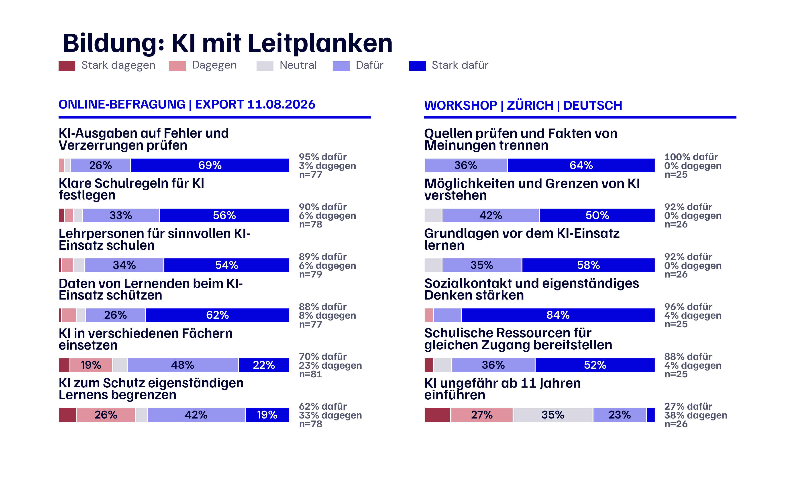

<em>Abb. 20: Bildung mit Leitplanken. Links stehen sechs ausgewählte Fragen aus dem Online-Export vom 11. August 2026; die Sieben-Punkte-Skala ist in fünf Kategorien gruppiert. Rechts stehen sechs Propositionen aus dem deutschsprachigen Zürcher Workshop auf ihrer ursprünglichen Fünf-Punkte-Skala. Zustimmung, Ablehnung und der jeweilige Nenner erscheinen neben jedem Balken.</em>

Sobald es von den Grundsätzen in den Unterricht ging, wurden die Ansichten vielfältiger. 70 Prozent unterstützten die Nutzung von KI in mehreren Schulfächern, 62 Prozent wollten Grenzen zum Schutz des eigenständigen Lernens, und 72 Prozent befürworteten eine Neugestaltung von Prüfungen und Aufgaben, obwohl fast ein Viertel dagegen war. Immer wieder kehrten zwei praktische Fragen zurück: Wann soll die direkte Nutzung beginnen, und wie kann eine Schule weiterhin erkennen, was Lernende selbst verstehen?

Eine verwandte Frage hatten wir bereits am 29. Mai einer separat rekrutierten Gruppe von 23 Personen in einer Live-Abstimmung gestellt: Wie viel KI-gestützte benotete Arbeit würden sie auf den einzelnen Bildungsstufen zulassen? Die kleine, anders zusammengesetzte Gruppe liefert einen zusätzlichen Hinweis, der getrennt von der August-Befragung zu lesen ist.

  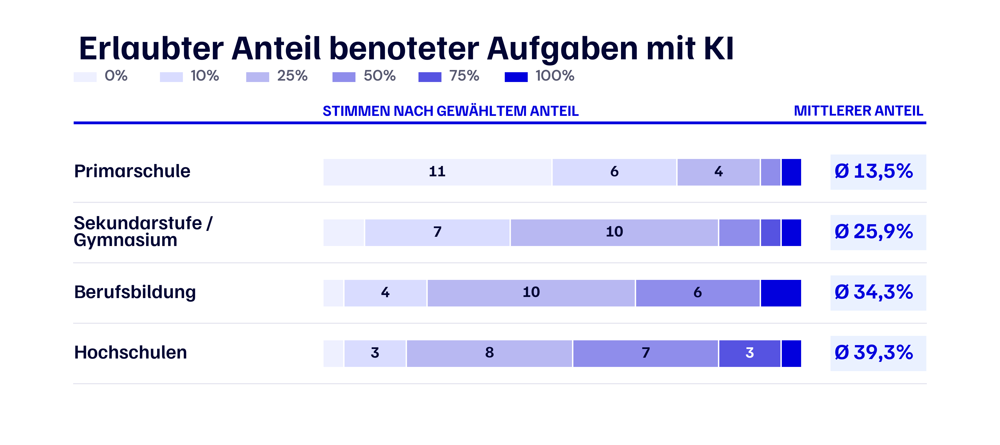

<em>Abb. 21: Erlaubter Anteil benoteter Aufgaben mit KI. Die Farben zeigen die gewählten Anteile, die Zahlen in den Balken sind Stimmen, und rechts ist der mittlere erlaubte Anteil hervorgehoben. Diese separate Live-Abstimmung fand am 29. Mai 2026 mit n = 23 je Bildungsstufe statt.</em>

Mit der Bildungsstufe verschoben sich die Antworten deutlich: In der Primarschule erlaubten 17 von 23 Personen KI bei höchstens 10 Prozent der benoteten Arbeit, während an Hochschulen 11 von 23 Personen einen Anteil von mindestens 50 Prozent zuliessen. Der Mittelwert stieg von 13,5 Prozent in der Primarschule auf 39,3 Prozent an Hochschulen.

In den Workshops wurde dieser schrittweise Ansatz durch Vorschläge für selbstständiges Schreiben vor einer KI-Überarbeitung, die Offenlegung der KI-Nutzung, beaufsichtigte Prüfungen, altersgerechte Werkzeuge und geschützte Räume für eigenständiges Arbeiten konkreter. Im deutschsprachigen Zürcher Raum erreichte die Prüfung von Quellen und die Unterscheidung von Fakten und Meinungen 100 Prozent Zustimmung, das Verständnis der Grenzen von KI 92 Prozent, das Lernen von Grundlagen vor dem KI-Einsatz 92 Prozent, die Stärkung von Sozialkontakt und eigenständigem Denken 96 Prozent und die Bereitstellung schulischer Ressourcen gegen ungleichen Zugang 88 Prozent. Eine Einführung von KI im Alter von ungefähr elf Jahren unterstützten nur 27 Prozent. Die Gemeinsamkeit lag bei den Fähigkeiten, die Schulen schützen und aufbauen sollen; das Einstiegsalter blieb offen.

Beim Zuhören kehrte das Gespräch immer wieder zum Zweck des Lernens zurück. Die Teilnehmenden konnten sich KI als Lernhilfe vorstellen, die Hinweise gibt, stärkere Lernende weiterbringt oder Lehrpersonen unterstützt und den Lernenden weiterhin die Aufgabe überlässt, einen eigenen Gedanken zu entwickeln. Unbehagen entstand, wenn das Werkzeug Anstrengung unsichtbar machte oder den sozialen Kontakt und die produktive Mühe verdrängte, durch die Fähigkeiten entstehen.

### 4.2.3 Arbeit: Wandel fair gestalten

Bei der Arbeit verlagerte sich der Schwerpunkt, und die stärkste Zustimmung sammelte sich um Fairness und menschliche Verantwortung. 90 Prozent wollten Beschäftigte an Produktivitätsgewinnen beteiligen, 84 Prozent befürworteten Einschränkungen für vollständig automatisierte Entscheide über Einstellung, Kündigung und Leistung, 83 Prozent unterstützten eine Überwachung auf Diskriminierung und 82 Prozent eine Weiterbildung für die aktuelle Tätigkeit (je n = 77).

  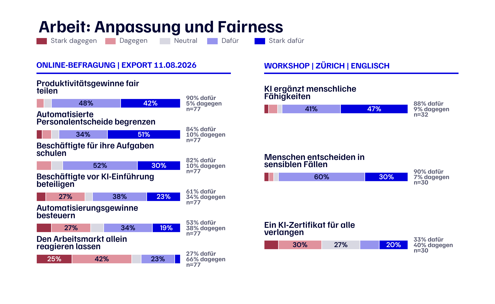

<em>Abb. 22: Arbeit, Anpassung und Fairness. Links stehen sechs Präferenzen aus dem Online-Export vom 11. August 2026, rechts sechs Propositionen aus dem englischsprachigen Zürcher Workshop. Beide Quellen verwenden dieselben fünf Farben; Skalen und Nenner bleiben separat gekennzeichnet.</em>

Bei den Instrumenten nahm die Übereinstimmung ab: Eine Beteiligung der Beschäftigten vor der Einführung von KI erhielt 61 Prozent Zustimmung und 34 Prozent Ablehnung, während eine Besteuerung von KI oder Automatisierung zugunsten betroffener Beschäftigter auf 53 Prozent Zustimmung und 38 Prozent Ablehnung kam. Nur 27 Prozent wollten den Arbeitsmarkt weitgehend selbst reagieren lassen, während 66 Prozent diesen Weg ablehnten.

In den Workshops wurden aus diesen allgemeinen Präferenzen konkrete Forderungen nach berufsspezifischer Weiterbildung, anfechtbaren automatisierten Entscheiden und einer fairen Beteiligung an Produktivitätsgewinnen. Im englischsprachigen Zürcher Raum wollten 88 Prozent, dass KI menschliche Fähigkeiten ergänzt, 93 Prozent unterstützten Weiterbildungsmöglichkeiten, 89 Prozent Hilfe für verdrängte Beschäftigte, 90 Prozent die Beteiligung von Menschen an sensiblen Entscheiden und 79 Prozent die Verantwortung von Unternehmen für KI-Folgen. Ein einziges KI-Zertifikat für alle Beschäftigten erhielt 33 Prozent Zustimmung. Die Teilnehmenden sahen die Notwendigkeit, den Übergang aktiv zu gestalten, unterstützten aber kein einzelnes Instrument für alle.

Dass KI Arbeit beschleunigen kann, konnten sich die Teilnehmenden leicht vorstellen. Schwieriger war die Frage, wer das Risiko des Übergangs trägt und wer die Gewinne erhält. Auf Post-its erschienen mögliche Verluste von Einstiegsstellen, der Unterstützungsbedarf älterer Beschäftigter und die knappen Ressourcen kleiner Unternehmen. An den Tischen bekam Fairness dadurch zwei Seiten: Menschen beim Wandel zu unterstützen und die Vorteile zu teilen.

### 4.2.4 Demokratie und Vertrauen: den Informationsraum schützen

Bei Demokratie und Vertrauen zeigte sich eine vorsichtigere Seite derselben Teilnehmenden. Im Online-Modul stimmten 94 Prozent zu, dass KI Meinungen und Verhalten manipulieren kann, 92 Prozent sahen das Risiko reproduzierter Verzerrungen, und jeweils 91 Prozent verbanden KI mit stärkerer Polarisierung und grösseren Schwierigkeiten beim Erkennen der Wahrheit. Die Bedrohung der digitalen Privatsphäre erhielt 87 Prozent Zustimmung.

  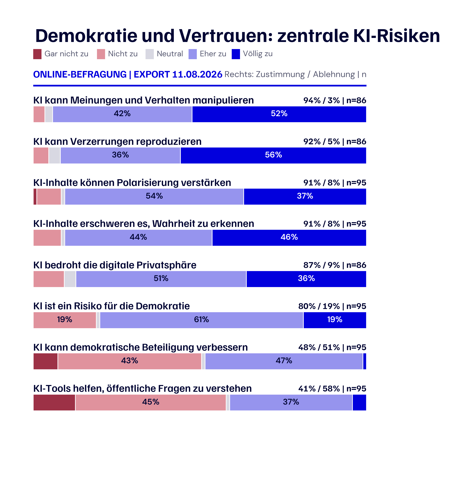

<em>Abb. 23: Demokratie und Vertrauen. Acht Fragen aus der Online-Befragung sind in zwei thematischen Spalten angeordnet. Jeder Balken zeigt die vollständige Verteilung auf der in fünf Kategorien gruppierten Sieben-Punkte-Skala; daneben stehen Zustimmung, Ablehnung und der jeweilige Nenner.</em>

Diese Sorge prägte auch das breitere Urteil über demokratische Folgen: 80 Prozent stimmten mindestens eher zu, dass KI ein Risiko für die Demokratie darstellt. Mögliche Vorteile erhielten weniger Unterstützung. 48 Prozent glaubten, dass KI die Beteiligung verbessern könnte, während 51 Prozent widersprachen; 41 Prozent betrachteten KI-Werkzeuge als Hilfe beim Verständnis öffentlicher Fragen, 58 Prozent waren anderer Meinung. Gleichzeitig unterstützten 78 Prozent der 93 Antwortenden öffentliche Abstimmungen oder Bürgerkonsultationen zur KI-Regulierung.

Über Online-Antworten und Workshops hinweg hörten wir mehr Vertrauen in öffentliche Beteiligung als in KI als Mittel dieser Beteiligung. Die Menschen verlangten überprüfbare Informationen, Schutz vor Manipulation, eine klare Herkunftskennzeichnung synthetischer Inhalte und durchsetzbare Regeln für Deepfakes. Ebenso wichtig war ihnen eine erkennbare Person oder Institution, die beim Versagen eines Informationssystems verantwortlich bleibt. Insgesamt war der Ton vorsichtiger als bei Bildung und Arbeit; öffentliche Kontrolle und Legitimität wogen schwerer als technologische Bequemlichkeit.

### 4.2.5 Was sich nach der Diskussion veränderte

Um zu sehen, ob auf die Diskussion eine Bewegung in den individuellen Ansichten folgte, verglichen wir zwanzig Positionen vor und nach den Workshops. Vier davon veränderten sich in allen statistischen Prüfungen. Abbildung 24 zeigt den Mittelwert auf der ursprünglichen Skala von 1 bis 7, wobei jeder Pfeil eine Veränderung in Skalenpunkten und keinen Personenanteil darstellt.

  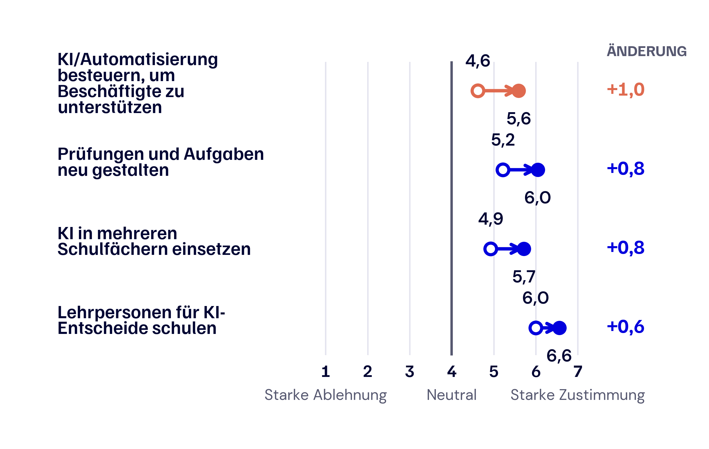

<em>Abb. 24: Vier Vorher-Nachher-Veränderungen. Offene Kreise zeigen den Online-Mittelwert, gefüllte Kreise den Mittelwert nach dem Workshop. Rechts steht die Veränderung in Punkten auf der Sieben-Punkte-Skala; die Zahl der verknüpften Paare reicht von n = 37 bis 42.</em>

Die grösste Bewegung betraf eine Besteuerung von KI- oder Automatisierungsgewinnen zugunsten betroffener Beschäftigter; der Mittelwert stieg von 4,6 auf 5,6. Auch die Zustimmung zur Neugestaltung von Prüfungen und Aufgaben erhöhte sich von 5,2 auf 6,0, zur Nutzung von KI über Schulfächer hinweg von 4,9 auf 5,7 und zur Vorbereitung der Lehrpersonen von 6,0 auf 6,6. Hinter diesen Veränderungen war ein gemeinsames Muster erkennbar: Die Zustimmung stieg dort, wo eine neue KI-Nutzung mit einer konkreten Schutzmassnahme oder einer faireren Verteilung der Vorteile verbunden war, etwa schulische Nutzung mit angepassten Prüfungen und vorbereiteten Lehrpersonen oder Automatisierung mit Unterstützung für betroffene Beschäftigte. Der Vergleich kann die Ursache der Veränderungen nicht bestimmen, zeigt aber, dass diese Positionen in Bewegung bleiben konnten.

## 4.3 Wie KI die Deliberation unterstützte

Begleitend zur eigentlichen Erhebung der Sichtweisen aus der Bevölkerung entwickelte und erprobte unser Forschungsteam [Murmi](https://www.murmi.org/), ein KI-gestütztes Werkzeug für Deliberation. Jeder Raum erlebte zwei Formate; die Themenzuordnung wurde zwischen den Räumen umgekehrt. In der menschlich moderierten Diskussion sprachen die Teilnehmenden direkt miteinander und hielten Ideen auf Post-its fest, anhand derer eine Moderationsperson das Gespräch zusammenfasste. In der KI-gestützten Diskussion transkribierte Murmi das Gespräch live und extrahierte Argumententwürfe als schwebende Karten auf den Smartphones der Teilnehmenden. Eine Moderationsperson prüfte die Karten, bevor die Teilnehmenden sie korrigierten, darauf reagierten und sie bewerteten. Aus den geprüften Argumenten und Bewertungen erzeugte Murmi anschliessend eine KI-generierte Zusammenfassung der Gemeinsamkeiten, welche die Teilnehmenden annehmen oder ablehnen konnten. Es wurden keine Audioaufnahmen gespeichert. Aus Sicht der Teilnehmenden führte der Ablauf von der Bewertung einzelner Argumentkarten zur Prüfung des generierten Berichts, in dem die Zusammenfassung der Gemeinsamkeiten zusammen mit der Zahl der Personen erschien, die ihr zustimmten.

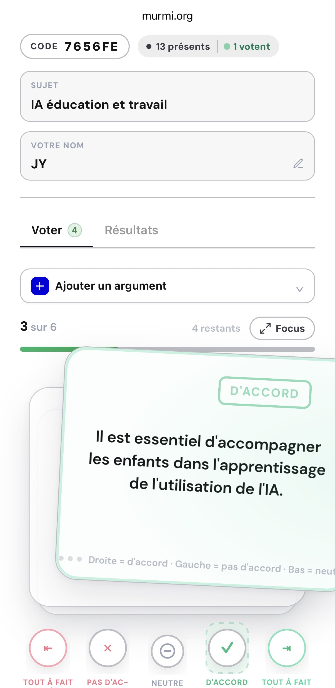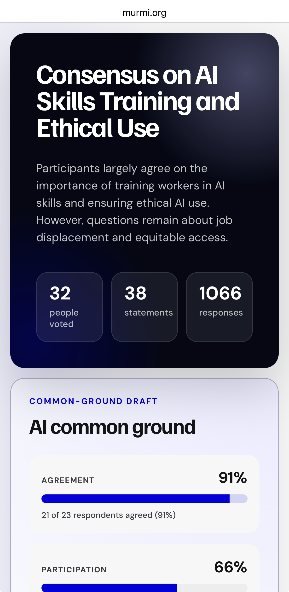

<em>Abb. 25: Murmi aus Sicht der Teilnehmenden. Links prüften die Teilnehmenden Argumentkarten und bewerteten jede Aussage auf einer fünfstufigen Skala. Rechts zeigte der generierte Bericht die daraus abgeleitete KI-Zusammenfassung der Gemeinsamkeiten und wie viele Antwortende ihr zustimmten. Screenshots aus den Workshops vom August 2026.</em>

In den KI-gestützten Diskussionen entstanden 96 der 136 Workshoppropositionen durch Murmis Extraktion; die übrigen 40 wurden von Teilnehmenden eingegeben. Während des Prozesses konnten die Teilnehmenden die Aussagen der anderen sehen, darauf reagieren und darüber abstimmen, bevor sie die Zusammenfassung der Gemeinsamkeiten prüften. Diese Interaktion hinterliess einen reichhaltigen Datensatz darüber, wie die Teilnehmenden argumentierten, wo sich ihre Ansichten annäherten und wo Unterschiede bestehen blieben. Von den 59 Personen, die eine Zusammenfassung der Gemeinsamkeiten prüften, stimmten ihr 49 zu. Als wir nach dem Workshop nach der Erfahrung fragten, zeigten die Antworten unterschiedliche Stärken der beiden Formate.

  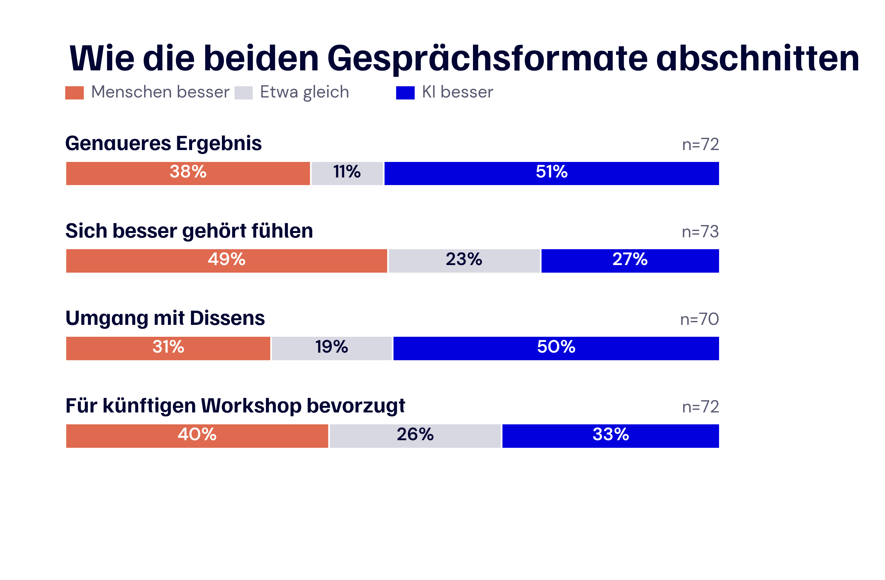

<em>Abb. 26: Vergleich der beiden Gesprächsformate durch die Teilnehmenden. Jeder Balken zeigt den Anteil, der die menschliche Moderation höher bewertete, beide Formate ungefähr gleich einstufte oder die KI-Unterstützung höher bewertete. Die menschliche Moderation kam immer zuerst, und das Thema wechselte zwischen den Formaten.</em>

Etwas mehr als die Hälfte, 51 Prozent, bewertete die KI-Unterstützung für ein genaues Endergebnis höher, und beim Umgang mit Meinungsverschiedenheiten und Minderheitspositionen waren es 50 Prozent. Die menschlich moderierte Diskussion wurde häufiger als besser dafür bewertet, dass sich Teilnehmende gehört fühlten, mit 49 gegenüber 27 Prozent. Auf die Frage nach einem künftigen Workshop bevorzugten 40 Prozent menschliche Moderation, 33 Prozent KI-Unterstützung, und 26 Prozent sahen beide ungefähr gleich.

Was die Teilnehmenden später berichteten, entsprach unseren Beobachtungen in den Räumen: KI half, ein längeres Gespräch in Propositionen zu überführen und Meinungsunterschiede sichtbar zu halten, während die menschliche Moderation eine stärkere Rolle für Anerkennung und Gehör spielte. Der Vergleich bleibt deskriptiv, weil die menschliche Moderation immer zuerst kam, die KI-Unterstützung danach folgte und das Thema zwischen den Formaten wechselte.

Auch von Raum zu Raum fiel die Erfahrung unterschiedlich aus. Der Mittelwert aus acht Fragen zu Beteiligung, Gehör und Genauigkeit des Endergebnisses reichte für das KI-gestützte Gespräch von 4,29 von 7 in der französischsprachigen Lausanner Gruppe bis 5,56 in der englischsprachigen Zürcher Gruppe. Bei der menschlichen Moderation lagen die Mittelwerte mit 5,17 bis 5,72 näher beieinander.

  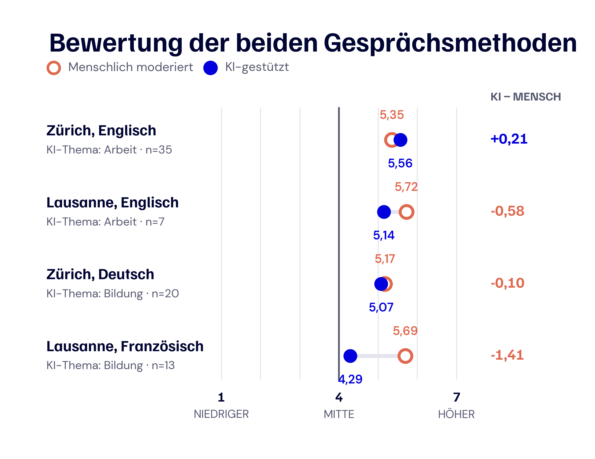

<em>Abb. 27: Bewertung der beiden Gesprächsmethoden in den vier Workshops. Die Skala reicht von 1 bis 7. Rechts steht der Mittelwert der KI-Unterstützung abzüglich des Mittelwerts der menschlichen Moderation. Die Themenzuordnung unterschied sich zwischen den Räumen. Die Ergebnisse beschreiben deshalb die einzelnen Workshops und isolieren keinen Einfluss von Sprache oder Ort.</em>

In den individuellen Vergleichen tritt der Gegensatz besonders klar hervor. Alle 13 Antwortenden in der französischsprachigen Lausanner Gruppe bewerteten das menschlich moderierte Gespräch höher; in der englischsprachigen Zürcher Gruppe bewerteten 20 das KI-gestützte Gespräch höher, 12 bevorzugten die menschliche Moderation und drei gaben beiden Formaten denselben Mittelwert.

Die Kommentare geben den Zahlen eine menschliche Erfahrung. Eine Person in Zürich schrieb: «Die KI fasste die Gedanken in Echtzeit zusammen, sodass nichts vergessen ging, und die Abstimmung erlaubte allen einen Beitrag.» Eine Person in Lausanne berichtete: «Die KI halluzinierte eine Antwort oder ein Argument. Die Plattform stellte es als Tatsache dar und glättete die Nuancen.» Andere erwähnten die Ablenkung durch Smartphones, zu wenig Zeit zur Prüfung der Ergebnisse, verlorene Details und die Unsicherheit darüber, wie die Zusammenfassungen entstanden waren.

Die jüngste Gruppe, im englischsprachigen Zürich, gab dem KI-gestützten Format die höchste Bewertung; die ältere französischsprachige Lausanner Gruppe nutzte KI seltener und bewertete das Format am tiefsten. Da sich die Räume auch in Grösse, Sprache, Thema, Moderation und Umsetzung unterschieden, können wir nicht bestimmen, welcher dieser Unterschiede das Muster hervorbrachte. Für künftige Workshops nehmen wir daraus die Bedeutung einer sichtbaren menschlichen Prüfung, genügend Zeit für Korrekturen und einer Gestaltung mit, welche die Aufmerksamkeit bei den Menschen im Gespräch belässt.

## 4.4 Was die Politik tun sollte

### 4.4.1 Sechs gut abgestützte Massnahmen

Zusammengelesen weisen die Online-Antworten, Workshopgespräche und die Nachbefragung auf sechs praktische Prioritäten hin. Die Zuordnung möglicher Verantwortlichkeiten in Tabelle 4.3 ist eine Interpretation unseres Forschungsteams, da die Teilnehmenden den Inhalt der Massnahmen diskutierten, aber nicht über die institutionelle Zuordnung abstimmten.

**Tabelle 4.3: Politische Prioritäten mit einer starken Grundlage in den Bürgerbeiträgen**

| Priorität | Sofortiger Schritt | Wichtige Akteure |
| --- | --- | --- |
| **Prüfen und Werkzeuge bedienen lehren** | Lernziele für Quellenprüfung, Fehlererkennung, Datenschutz und verantwortliche Nutzung festlegen. | Kantone, Schulen, Berufsbildung, Hochschulen |
| **Lehrpersonen und Beschäftigte vorbereiten** | Weiterbildung an Fächer, Berufe und konkrete Entscheide anpassen und regelmässig aktualisieren. | Kantone, Ausbildungsinstitutionen, Arbeitgeber, Sozialpartner |
| **Regeln vor dem Einsatz festlegen** | Zweck, zulässige Nutzung, Datennutzung, Qualitätskontrolle und Zuständigkeit vor einer Einführung dokumentieren. | Schulen, Arbeitgeber, öffentliche Stellen |
| **Folgenreiche Entscheide menschlich verantworten** | Menschliche Prüfung und einen klaren Beschwerdeweg für Personal-, Leistungs- und Bildungsentscheide verlangen. | Bund, Kantone, Arbeitgeber, Bildungsinstitutionen |
| **Informationsintegrität schützen** | Herkunft und Grenzen von KI-Inhalten sichtbar machen und Manipulation unabhängig prüfen lassen. | Bund, Kantone, Medien, Plattformanbieter |
| **Zugang und Vorteile fair verteilen** | Schulen und kleine Unternehmen mit knappen Ressourcen unterstützen und Beschäftigte bei Übergängen absichern. | Bund, Kantone, Arbeitgeber, Sozialpartner |

### 4.4.2 Offene Fragen gezielt erproben

Mehrere Gespräche führten zu einer gemeinsamen Zielrichtung, liessen den Weg dorthin jedoch offen. Tabelle 4.4 führt diese Entscheidungen zusammen und zeigt, worauf sie sich stützen und was die Politik in der Praxis noch prüfen sollte.

**Tabelle 4.4: Grundlage der offenen politischen Entscheidungen**

| Offene Entscheidung | Was die Bürgerinnen und Bürger sagten | Was geprüft werden sollte |
| --- | --- | --- |
| **Wann und wie Schülerinnen und Schüler KI nutzen sollen** | 70 Prozent unterstützten die Nutzung über Schulfächer hinweg. 62 Prozent befürworteten Grenzen zum Schutz des eigenständigen Lernens. Im deutschsprachigen Zürcher Workshop unterstützten nur 7 von 26 eine Einführung im Alter von ungefähr elf Jahren. | Alters- und fachspezifische Ansätze, gemessen an eigenständiger Kompetenz, Lernfortschritt, Datenschutz und Belastung der Lehrpersonen. |
| **Wie Prüfungen angepasst werden sollen** | 72 Prozent unterstützten eine Neugestaltung von Prüfungen und Aufgaben, fast ein Viertel war dagegen. In einer separaten Live-Abstimmung stieg der mittlere erlaubte Anteil KI-gestützter benoteter Arbeit von 13,5 Prozent in der Primarschule auf 39,3 Prozent an Hochschulen. | Formate, die Eigenleistung sichtbar machen, zulässige KI-Nutzung festlegen und zur Bildungsstufe passen. |
| **Wie Weiterbildung in der Arbeitswelt organisiert werden soll** | 82 Prozent unterstützten Weiterbildung für die aktuelle Tätigkeit. Im englischsprachigen Zürcher Workshop befürworteten 25 von 28 Hilfe für Menschen, die durch KI arbeitslos werden könnten; eine Person bemängelte danach, «Kompetenzen zur Vorbereitung auf Arbeitslosigkeit» seien im Ergebnis noch zu wenig sichtbar. Ein einziges Zertifikat für alle Beschäftigten erhielt nur 33 Prozent Zustimmung. | Betriebliche Weiterbildung für Beschäftigte sowie öffentlich zugängliche Umschulung, Beratung und finanzielle Unterstützung für Menschen, denen ein Stellenverlust droht oder die bereits arbeitslos sind. Kleine Unternehmen, ältere Beschäftigte und wenig digitalisierte Berufe sollten einbezogen werden. |
| **Wie Beschäftigte mitwirken sollen** | 61 Prozent unterstützten eine Mitsprache vor der Einführung von KI, 34 Prozent waren dagegen. Eine Person schrieb im Online-Modul: «Auch die breitere Belegschaft sollte mitreden können, denn sie wird von den Folgen betroffen sein.» | Frühzeitige Information, Meldung von Risiken, Konsultation und Überprüfung der Folgen nach der Einführung. |
| **Wie Produktivitätsgewinne verteilt werden sollen** | 90 Prozent unterstützten eine Beteiligung der Beschäftigten an den Gewinnen. Eine Besteuerung von KI oder Automatisierung erhielt 53 Prozent Zustimmung und 38 Prozent Ablehnung. Nach dem Workshop stieg der Mittelwert der Zustimmung von 4,6 auf 5,6. | Steuer-, Weiterbildungs-, Übergangs- und Beteiligungsmodelle getrennt beurteilen. |

## 4.5 Wie wir mit KI leben wollen

Während der beiden Workshoptage waren die unterschiedlichen Ausgangspunkte der Menschen leicht zu erkennen. Wer an der ETH studiert und KI täglich nutzt, ist zum Beispiel eher bereit für eine raschere Einführung, während eine pensionierte Person in der Westschweiz womöglich zuerst an ihre Enkelkinder denkt und sich fragt, was sie noch selbst lernen werden. Beide Anliegen gehören in dasselbe Gespräch. Die Menschen beurteilten KI dort, wo sie in ihr eigenes Leben getreten war: in der Schule, bei der Arbeit, in den Informationen, die ihnen begegneten, und in Entscheidungen, die sie betrafen. Sie waren offen für Werkzeuge, die das Lernen unterstützen, Arbeit erleichtern, den Zugang zu Wissen erweitern oder Routineaufgaben übernehmen, sofern sie menschliche Fähigkeiten stärken und klare Grenzen gelten.

Für die Politik ergibt sich daraus eine recht klare Richtung. In der Bildung verlangten die Teilnehmenden kritische Quellenprüfung, vorbereitete Lehrpersonen, klare Regeln, geschützte Daten und genügend Raum, damit Lernende eigene Fähigkeiten entwickeln. Bei der Arbeit wollten sie praxisnahe Weiterbildung, die auch bei drohendem Stellenverlust und in der Arbeitslosigkeit zugänglich bleibt, eine faire Beteiligung an Produktivitätsgewinnen, Schutz vor Überwachung und menschliche Verantwortung bei folgenreichen Entscheiden. Für die Demokratie forderten sie stärkere Schutzmassnahmen gegen Manipulation und eine klarere Verantwortlichkeit für KI-generierte Informationen. Die grösste Übereinstimmung bestand bei diesen Zielen; das richtige Einstiegsalter in der Schule, die Gestaltung von Prüfungen, die betriebliche Mitsprache und eine Besteuerung der Automatisierung blieben offen. Gemeinsame Grundsätze können das Handeln bereits heute leiten, während umstrittene Lösungen transparent in realen Situationen erprobt und zusammen mit den betroffenen Menschen ausgewertet werden.

Das Zusammenbringen der Menschen fügte etwas hinzu, das keine Tabelle und keine Zusammenfassung vollständig erfassen kann. Die Argumentkarten und die KI-generierte Zusammenfassung halfen, den Überblick über ein komplexes Gespräch zu behalten; im direkten Austausch hörten die Teilnehmenden, weshalb jemand mit einer anderen Lebenserfahrung zu einem anderen Schluss kam. Sie änderten ihre Meinung nicht immer, verstanden den Konflikt danach aber oft besser und fanden Gemeinsamkeiten, mit denen sie leben konnten. Diese Erfahrung gehört ins Zentrum der grösseren Aufgabe von Swiss AI Futures. Während sich die Technologie weiterentwickelt, sollte auch die Beteiligung der Bevölkerung durch wiederkehrende Gelegenheiten fortgesetzt werden, ihre Folgen zu prüfen, ihre Richtung zu hinterfragen und über gesellschaftliche Unterschiede hinweg zuzuhören. Die demokratische Tradition der Schweiz bietet dafür eine starke Grundlage. Eine glaubwürdige Schweizer KI-Zukunft wächst mit einer Öffentlichkeit, die sie verstehen, mitgestalten und ihren eigenen Platz darin erkennen kann.
