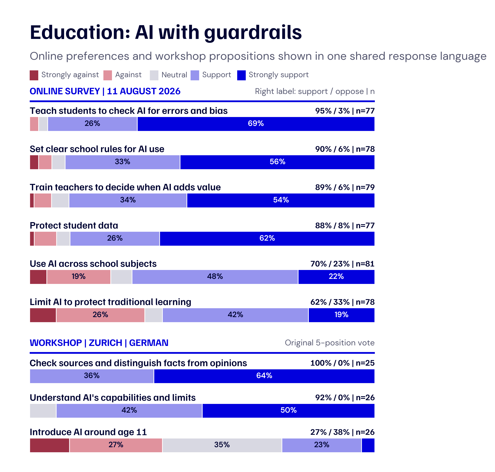
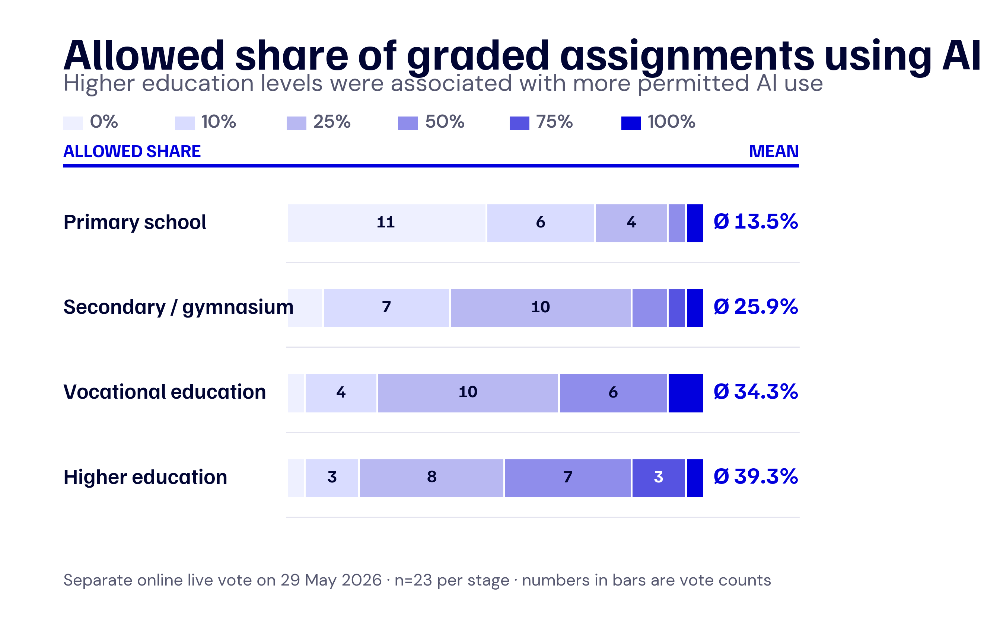
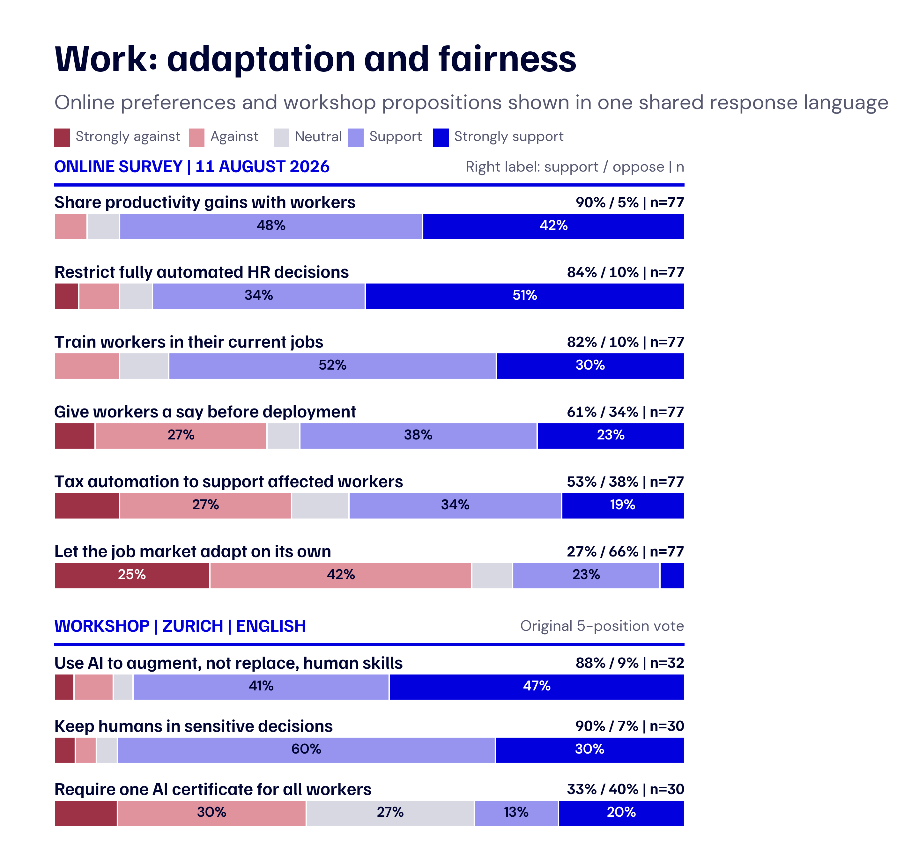
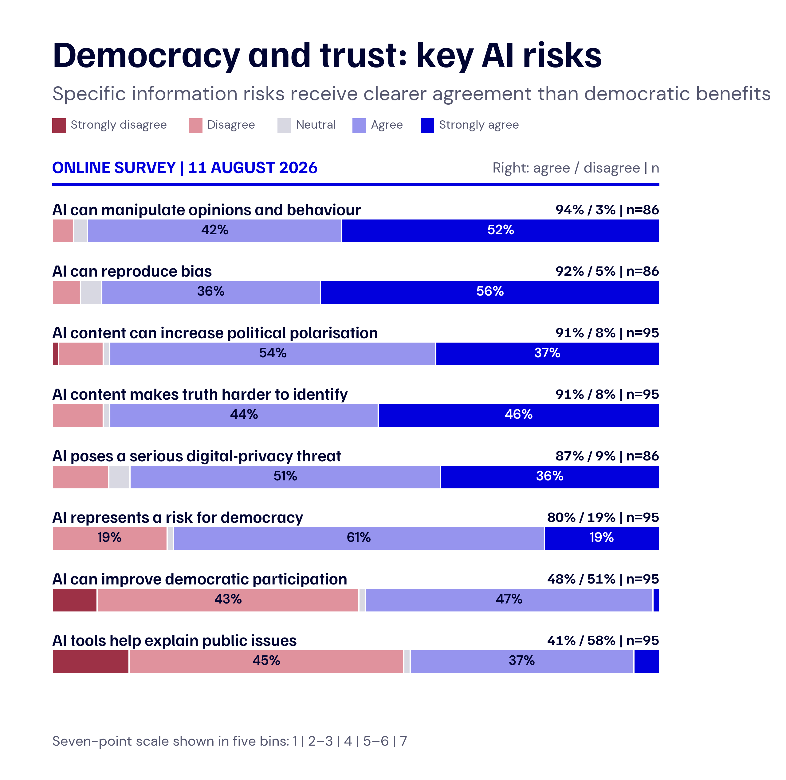
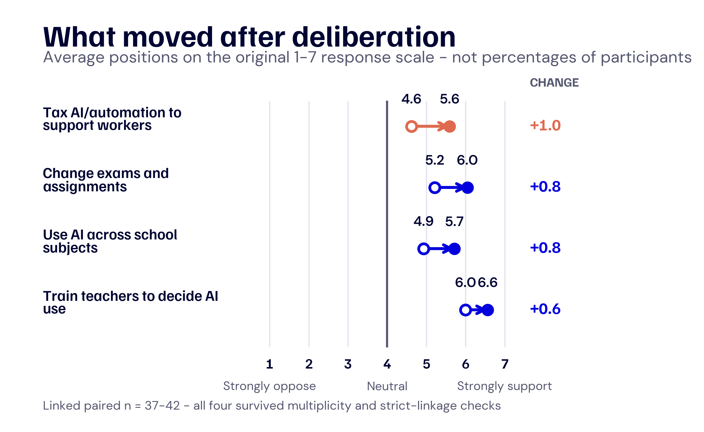

# 4. Public views on AI: opportunities, conditions, and red lines

How should Switzerland respond to AI when the evidence is still developing and the technology already shapes daily life? Before asking citizens, this project built a foundation in two earlier phases.

Phase 1 brought together literature reviews, analyses of public and institutional debates, and classroom experiments. This work showed what research already tells us about AI in education and work, how institutions are responding, and how access to an LLM can affect learning. Phase 2 convened expert groups to examine future skills, governance questions, and possible scenarios.

Phase 3 turned to citizens. An online survey gathered a broad range of views. Two workshops in Zurich and Lausanne then gave participants time to examine the evidence, question the scenarios, and discuss the role AI should play in education and work. This chapter reports what they thought, which conditions they set, where they drew red lines, and what they expect from policy. A smaller study of AI-supported facilitation ran alongside the workshops and remains a secondary part of the analysis.

## 4.1 How we collected citizen input

### 4.1.1 The purpose: bring citizens’ priorities into the project

Research can estimate the effects of AI, and experts can explain institutional trade-offs. Citizens add experience from education, work, public services, and democratic life. They also judge which benefits seem worth pursuing and which risks require limits.

The process therefore went beyond a simple measure of support or opposition. Participants described the uses they would accept, the safeguards they expected, and the outcomes they considered unacceptable. Their reasons show why the same application can appear helpful in one setting and harmful in another.

Deliberative-democratic research considers both preferences and the reasons behind them. It gives people space to review information, hear other views, and explain what guides their choices (Bächtiger, Dryzek, Mansbridge, and Warren, 2018; Fishkin, Luskin, and Jowell, 1998).

### 4.1.2 Three linked sources of citizen input

We collected citizen input in three steps:

1. **Online survey:** a broad first picture of AI use, trust, perceived risks, policy preferences, and free-text arguments.
2. **Workshops in Zurich and Lausanne:** small-group discussions that explored why participants held these views and turned them into conditions, red lines, and policy proposals.
3. **Post-workshop survey:** repeated questions that showed whether selected positions changed after discussion.

Each source answers a different question. The online survey provides breadth. The workshops provide reasons in citizens’ own language. The post-workshop survey tracks change. We compare the findings. The samples remain separate.

### 4.1.3 What the workshops added

Each workshop group discussed AI in education and at work. Participants identified promising uses, practical concerns, and unacceptable outcomes. They recorded ideas on Post-it notes, discussed proposals, voted on selected statements, and produced a short policy package with:

* two or three recommendations.
* a reason for each recommendation.
* any remaining disagreement or uncertainty.

The workshops added the reasons behind each position. For example, some participants supported AI-assisted learning and still wanted students to research, write, and verify information themselves.

### 4.1.4 A secondary test of AI-supported deliberation

The project also tested whether AI could help groups organise a discussion. Each room discussed one topic with a human facilitator and the other with AI support. In the French- and German-speaking rooms, work was human-facilitated and education was AI-supported. In the English-speaking rooms, the order was reversed.

During the AI-supported sessions, the system converted spoken arguments into short statements and draft proposals. Participants could accept, reject, or revise every output and retained control of the final recommendation. This chapter gives the method comparison a secondary role. Its main evidence comes from what citizens said, supported, opposed, and proposed.

### 4.1.5 How we analysed the material

We analysed survey response distributions, qualitative statements and group outputs, and linked before-and-after responses separately. We coded free-text answers and workshop materials by topic. We also marked each contribution as an **opportunity**, **condition**, or **red line**. Quotations and room-specific votes retain their workshop and language context.

We analysed repeated survey items on their original seven-point scale. The tests used linked comparisons, bootstrap uncertainty intervals, Wilcoxon tests, and a Benjamini-Hochberg correction across twenty items. The shorter field instrument did not support the planned Deliberative Reason Index. We report the observed changes and give no single score for deliberative quality.

### 4.1.6 Participants and safeguards

We recruited participants through civil-society organisations, the TA-SWISS network, and digital outreach. The sample had above-average civic engagement, educational attainment, and experience with AI. The results describe the people who took part. The Swiss population as a whole may differ. Online participation was unpaid. Workshop participants received a CHF 40 voucher.

All participants gave informed consent. We stored contact and payment details separately from research data. We coded or pseudonymised responses and removed identifying details from free text or transcripts where needed. Participants could withdraw without disadvantage. During AI-supported sessions, participants reviewed every summary and proposal before it could become part of the group output.

## 4.2 What citizens think about AI

### 4.2.1 Three data sources, three distinct contributions

Each source contributes a different kind of evidence.

| Data source | Analytical basis | What it tells us |
| --- | --- | --- |
| Online survey | Export of 11 August 2026: 135 submitted records; 103 people included after screening; 485 usable free-text responses; plus a separate live vote on 29 May with 23 people | Breadth: initial attitudes, policy preferences, and participants’ language |
| Workshops | Four rooms; 76 workshop questionnaires; 140 Post-it rows; 136 MURMI propositions | Depth: reasons, conditions, red lines, open decisions, and room-specific votes |
| Post-workshop survey | 76 questionnaires; 49 people uniquely linked to the online baseline; 36 to 44 paired responses per item | Change: repeated policy positions and evaluations after the workshops |

A Post-it records a group idea. Each workshop proposition belongs to the room that voted on it. Before-and-after results include only people who could be linked across both surveys. Each figure gives its own denominator and scale. All online results below use the 11 August export. It contains 103 screened participants, compared with 81 in the previous interim analysis.

### 4.2.2 AI is welcome when safeguards are in place

Citizens combined openness with caution. They welcomed uses that support learning, reduce repetitive work, or extend human capability. Concern grew when AI could replace people, weaken skills, make decisions hard to contest, or distribute benefits unfairly.

Participants used AI often and trusted it cautiously. Eighty-nine of 103 used AI at least weekly, including 68 who used it daily or almost daily. Fifteen per cent expressed high trust in AI-generated text, and 57 of 100 said they always or often checked AI answers. Ninety-two per cent agreed that AI can reproduce bias, 90% warned of a loss of critical and independent thinking, and 91% saw benefits when people learn to use AI competently.

The qualitative analysis groups contributions as **opportunities**, **conditions**, and **red lines**. One online participant wrote: “Checking sources, questioning results, and asking what we ultimately want to produce help us distinguish the opportunities from the risks of using AI.” Another called for wider staff involvement: “Other employees should have a say too, because they are the ones who will be affected. Decisions about AI should involve IT staff and the wider workforce.” The first statement was translated into English. Both were lightly shortened.

| Topic | Extract from the workshop | Workshop |
| --- | --- | --- |
| Education | “AI should be used in some form. Schools should distinguish fundamental critical skills from tool use. AI should lead students to think. Harder tasks can then use it to raise the level of the exercise.” | Zurich, English |
| Education | “Students still need to know how to research, ask the right questions, and check what is fabricated. Use AI to start, then check the information yourself. Students could write first and use AI to edit.” | Zurich, English |
| Education | “Freedom should increase with age: strict in primary school, fully open at doctorate level. Teach students to use AI for correction and improvement while preserving their own work.” | Lausanne, English |
| Work | “How can we know which AI is best? Responsibility should be shared among government, employers, and education.” | Lausanne, French |
| Work | “Companies may require the use of AI. In that case, they should provide state-supported training as a form of worker protection.” | Zurich, German |
| Work | “How will productivity gains be shared? One example moved customer-service employees into remote interior-design consulting: new roles can be created during workforce transition.” | Zurich, German |

The French and German statements were translated into English and lightly edited for grammar and length. Across the statements, citizens accepted AI when it extended human capability and preserved the underlying skill and human responsibility.

### 4.2.3 Education: AI with guardrails

In education, the strongest consensus concerned the critical evaluation of AI. In the updated export, 95% supported teaching students to identify errors and bias. Three per cent opposed this (n = 77). Teacher training, clear rules, and protection of student data received about 88 to 90% support, with 77 to 79 valid responses each.

  

<em>Figure 19: Education with guardrails. The upper panel shows selected items from the online export of 11 August 2026 on a seven-point scale collapsed into five categories. The lower panel shows propositions from the German-speaking Zurich workshop on their original five-point scale. The sources remain separate. Support, opposition, and the relevant denominator appear on the right.</em>

Views varied more on implementation. Seventy per cent supported using AI across school subjects. Sixty-two per cent also wanted limits to protect traditional learning. Seventy-two per cent supported redesigning examinations and assignments. Almost one quarter opposed it. Participants asked when direct AI use should begin and how schools can still see what a student understands independently.

A separate live vote on 29 May asked 23 participants how much AI-supported graded work they would allow at each educational stage.

  

<em>Figure 20: Allowed share of graded assignments using AI. Colours show the proportion of AI-supported graded work the 23 voters would allow at each educational stage. Numbers inside the bars are vote counts. The mean selected share appears on the right.</em>

Permission increased with educational level. In primary school, 17 of 23 allowed AI in no more than 10% of graded work. In higher education, 11 of 23 allowed it in at least 50%. The mean rose from 13.5% in primary school to 39.3% in higher education. Participants gave students more freedom as they progressed through education.

Workshop votes showed the same concern for basic skills. All 25 recorded participants in the German-speaking Zurich room supported teaching learners to distinguish facts from opinions and check sources. Seven of 26 supported introducing AI at around age eleven. Post-its proposed progressive hints, independent writing before AI editing, disclosure of AI use, supervised assessment, and protected spaces for independent work. Participants agreed on critical use. They left the appropriate starting age open.

### 4.2.4 Work: adaptation and fairness

On work, the strongest support was for fairness and human responsibility. Ninety per cent wanted workers to share in productivity gains. Eighty-four per cent favoured restrictions on fully automated hiring, dismissal, and performance decisions. Monitoring for discrimination received 83% support. Training for workers’ current jobs received 82% support (n = 77 for each item).

  

<em>Figure 21: Work, adaptation, and fairness. The upper panel shows preferences from the online export of 11 August 2026. The lower panel shows selected propositions from the English-speaking Zurich workshop. The two sources remain separate.</em>

Specific instruments divided opinion. Worker participation before workplace deployment received 61% support and 34% opposition. Taxing AI or automation to support affected workers received 53% support and 38% opposition. Twenty-seven per cent wanted to leave the labour market to adjust on its own. Sixty-six per cent rejected that approach.

Participants called for occupation-specific training, contestable automated decisions, and a fair share of productivity gains. In the English-speaking Zurich workshop, 88% wanted AI to augment human skills. Ninety per cent wanted people to remain involved in sensitive decisions. A single AI certificate for all workers received 33% support. Participants agreed that institutions should manage the transition and remain responsible. They preferred different policy tools.

### 4.2.5 Democracy and trust: concrete risks

The updated online survey asked about information risks and possible democratic benefits. Ninety-four per cent agreed that AI can manipulate opinions and behaviour. Ninety-two per cent said it can reproduce bias. Increased polarisation and greater difficulty identifying what is true each received 91% agreement. The threat to digital privacy received 87% agreement. Depending on the item, 86 or 95 people answered.

  

<em>Figure 22: Democracy and trust. The figure uses the online export of 11 August 2026 and shows the complete distribution on the seven-point scale collapsed into five categories. Agreement, disagreement, and the relevant denominator appear on the right.</em>

Views on broader democratic effects were mixed. Eighty per cent agreed at least somewhat that AI poses a risk to democracy. On whether AI could improve democratic participation, 48% agreed and 51% disagreed. Forty-one per cent considered AI tools helpful for understanding public issues. Fifty-eight per cent disagreed. Public votes or citizen consultations on AI regulation received support from 78% of 93 respondents. Citizens placed priority on protection against manipulation, verifiable information, and participation in which people keep decision-making power.

### 4.2.6 What changed after discussion

Four of the twenty repeated positions changed across all statistical checks. The figure shows mean support on the original scale from 1 to 7. Each arrow measures scale points. It does not show the share of people who changed their answer.

  

<em>Figure 23: Four before-and-after changes. Open circles show the online mean. Filled circles show the post-workshop mean. The change in points on the seven-point scale appears on the right.</em>

The largest change concerned support for taxing gains from AI or automation to assist affected workers. The mean rose from 4.6 to 5.6. Support for redesigning examinations and assignments rose from 5.2 to 6.0. Support for using AI across school subjects rose from 4.9 to 5.7, and support for teacher training rose from 6.0 to 6.6.

The shifts point to **governed integration**. Participants became more open to classroom use when it came with better assessment design and stronger teacher competence. They also gave more support to a fair distribution of automation gains.

### 4.2.7 What differed across workshop groups

The four rooms differed in location, language, size, topic order, and participant profile. The tables keep the same room order to make these differences visible.

**Table 4.1: Workshop outputs**

| Workshop | Session order | Support for workshop propositions | Policy package accepted |
| --- | --- | ---: | ---: |
| Lausanne, French | Work → AI-supported education | 79% | 69% (9/13) |
| Lausanne, English | Education → AI-supported work | 68% | 83% (5/6) |
| Zurich, German | Work → AI-supported education | 74% | 82% (14/17) |
| Zurich, English | Education → AI-supported work | 68% | 91% (21/23) |

**Table 4.2: Linked baseline profile**

| Workshop | Linked n | Under age 35 | University degree | At least weekly AI use |
| --- | ---: | ---: | ---: | ---: |
| Lausanne, French | 9 | 22% | 56% | 67% |
| Lausanne, English | 5 | 40% | 100% | 80% |
| Zurich, German | 15 | 67% | 67% | 93% |
| Zurich, English | 18 | 89% | 89% | 89% |

The linked Lausanne French-speaking group was older and less strongly academic than the Zurich German-speaking group. The two English-speaking rooms both recorded 68% support across their own proposition sets. The small linked Lausanne profile included five people. Each room voted on different statements, and several factors changed at once. The figures cannot establish language or location effects. They show why group context must remain visible when citizen input is interpreted. Ratings of the AI-supported format ranged from 4.3 to 5.6 on a seven-point scale. We treat them as a secondary methodological result.

## 4.3 What citizens expect from policy

Citizens identified six policy priorities:

1. **Teach verification alongside tool use.** Students and workers should be able to check sources, question outputs, and recognise when AI is unreliable.
2. **Train people before expecting them to use AI.** Teachers and workers need preparation for the decisions they actually face, and that training must keep pace with the tools.
3. **Set rules before deployment.** Schools and employers should define purpose, data use, quality control, and responsibility before introducing AI.
4. **Keep consequential decisions under human responsibility.** Hiring, dismissal, performance assessment, and educational evaluation require traceable human oversight and a clear route for appeal.
5. **Protect information integrity democratically.** Rules addressing manipulation and misleading content require independent scrutiny, traceable sources, and public participation. People must retain democratic judgement. AI can provide information.
6. **Distribute access and benefits fairly.** Schools with limited resources, small companies, and workers affected by change need practical support. The benefits should reach people across society.

Several implementation questions need testing before broad deployment:

- the age at which direct classroom use of AI becomes appropriate.
- whether a single AI certificate can serve very different occupations.
- how workers should participate in deployment decisions.
- which forms of benefit-sharing or taxation work in practice.

> When AI is used, people must remain capable and responsible.

**Data and reproducibility.** The analysis package dated 21 August 2026 includes scripts, aggregate tables, source hashes, translated extracts, and figures. Linkage data and individual voting data remain restricted.
